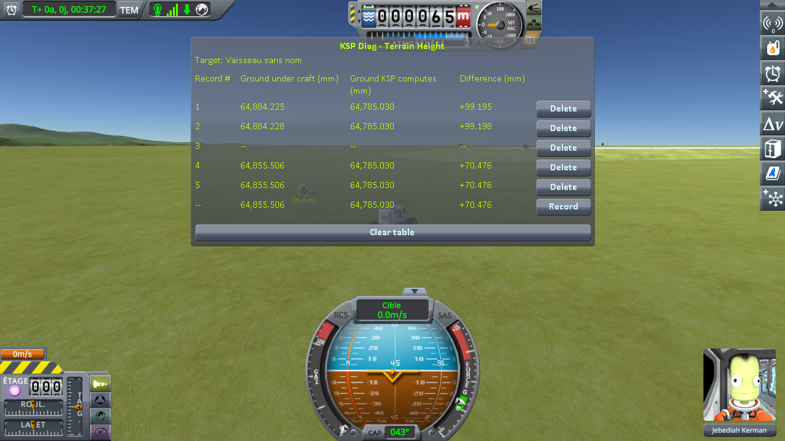

# The measurements: coming back to a craft you left

Part of [KSP Diag - Terrain Height](../README.md): the readings taken with
[the approach protocol](the-protocol-approach.md) — a craft parked on bare ground, a rover driving
away until the game unloads it, then coming back. Nothing is loaded at any point: from the first line
to the last, it is one single flight.

The save the protocol uses is [`diag/approach-kerbin.sfs`](../diag/approach-kerbin.sfs), and
[the protocol page](the-protocol-approach.md#the-save) says what it holds.

## The install

KSP 1.12.5 on Windows, with `GameData` holding Harmony, ModuleManager,
[KSP Community Fixes](https://github.com/KSPModdingLibs/KSPCommunityFixes) 1.41.1, this mod,
[KSP Diag - Landed Vessel](https://github.com/lhervier/KSP-Diag-LandedVessel), which reads the parked
craft at the same moments, and [KSP-MCPServer](https://github.com/lhervier/KSP-MCPServer),
which drives the rover, and nothing else.

The six round trips were played by [the script of the protocol](the-protocol-approach.md#played-by-a-script),
`run-approach.py`.

## The readings

Six round trips in a row, in one flight. The table was cleared between them, so each screenshot holds
one round trip and its first line is the last line of the one before. The bottom line of each is the
reading in progress, not a record. The round trip pictured under the protocol was taken by hand, in
an earlier series.

**Ground KSP computes** reads 64,785.030 mm on every line of the six screenshots, so every change
below is a change of the ground under the craft. In *Difference*, in millimetres:

| round trip | line 2, before | line 4, back in range | line 5, settled | across the round trip | screenshot |
|---|---|---|---|---|---|
| 1 | +99.198 | +70.476 | +70.476 | **−28.722** | [`run1.png`](../imgs/measures/approach/run1.png) |
| 2 | +70.476 | +76.974 | +76.971 | **+6.495** | [`run2.png`](../imgs/measures/approach/run2.png) |
| 3 | +76.971 | +52.432 | +52.425 | **−24.546** | [`run3.png`](../imgs/measures/approach/run3.png) |
| 4 | +52.425 | +80.627 | +80.651 | **+28.226** | [`run4.png`](../imgs/measures/approach/run4.png) |
| 5 | +80.651 | +87.034 | +87.032 | **+6.381** | [`run5.png`](../imgs/measures/approach/run5.png) |
| 6 | +87.032 | +49.865 | +49.865 | **−37.167** | [`run6.png`](../imgs/measures/approach/run6.png) |

Line 1 of every round trip is not in the table: it carries the same three numbers as line 2, to the
micrometre — except at the opening of the scene, the first line of all, where the craft handed back by
the save is still settling, three thousandths of a millimetre away.

**→ What they show: [What the measurements show: coming back to a craft you left](what-the-measurements-show-approach.md)**

## The logs

[`diag/runs/approach-stock.log`](../diag/runs/approach-stock.log) — the `KSP.log` of the session the six
round trips were taken in; what the script printed is in
[`approach-stock-script.txt`](../diag/runs/approach-stock-script.txt), and every line it recorded, in
both instruments, in [`approach-stock-lines.json`](../diag/runs/approach-stock-lines.json).
