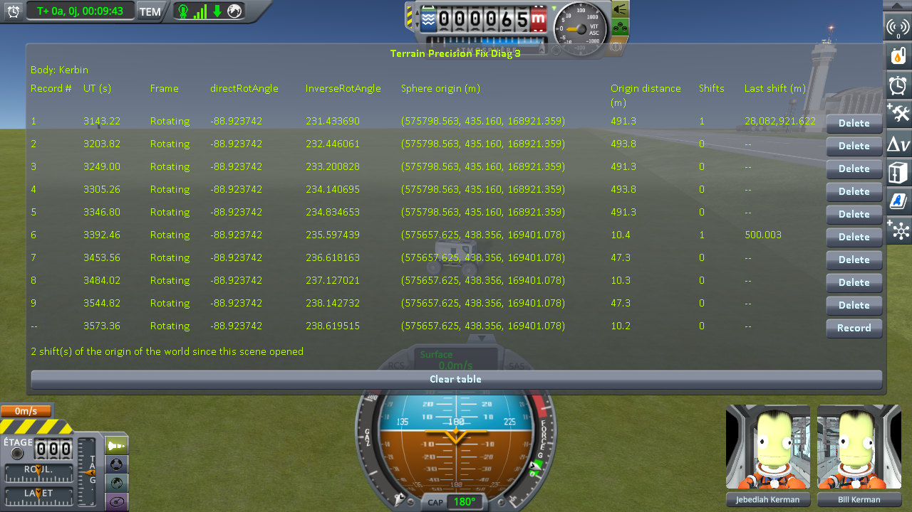
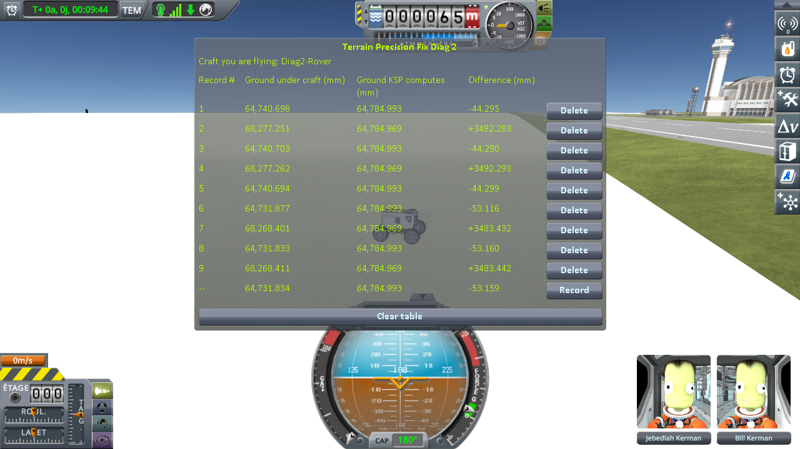
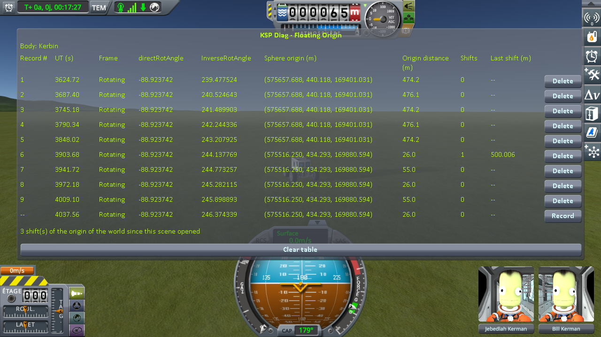
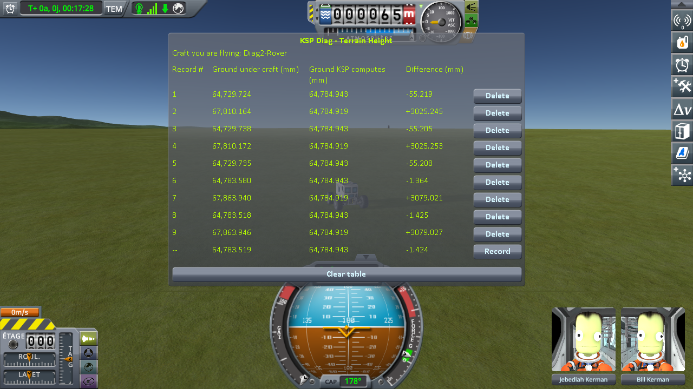
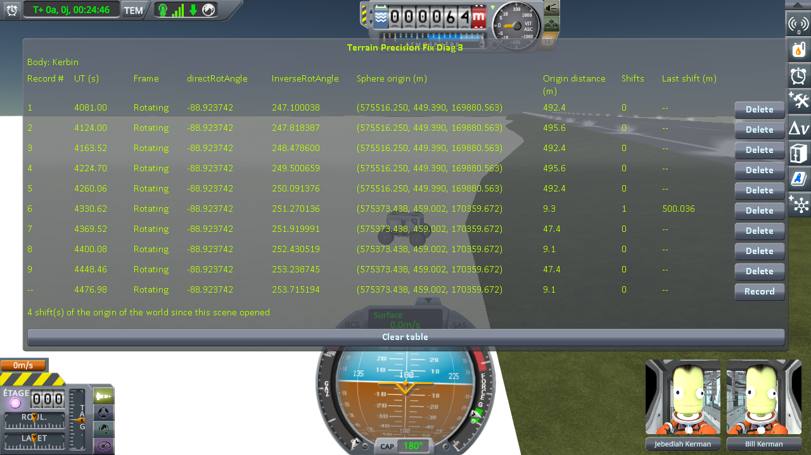
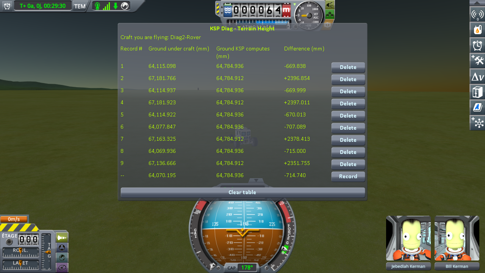
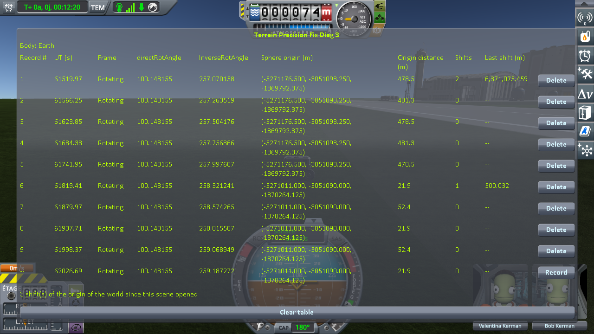
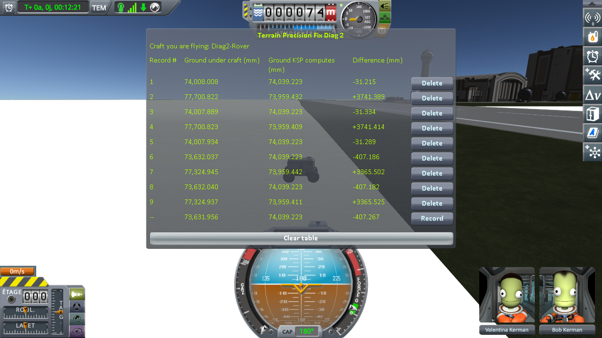
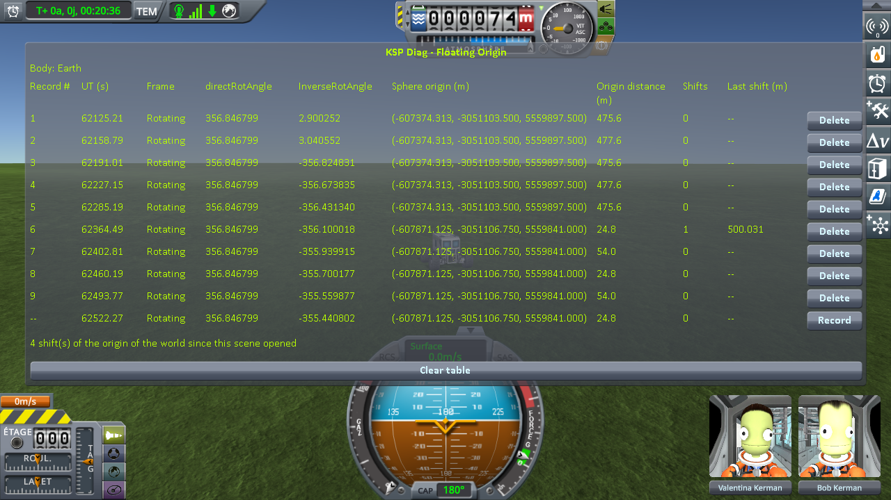
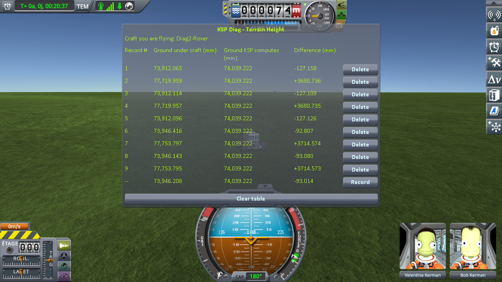

# The measurements: the runway and the grass, while the world moves

Part of [KSP Diag - Terrain Height](../README.md): the readings taken with
[the protocol](the-protocol-driving-runway.md) — a rover alone by the runway of the KSC, reading a spot
on the grass and a spot on the deck just before and just after the game moves its whole world. Nothing
is loaded at any point: from the first line to the last, it is one single flight.

## The install

KSP 1.12.5 on Windows, with `GameData` holding Harmony, ModuleManager,
[KSP Community Fixes](https://github.com/KSPModdingLibs/KSPCommunityFixes) 1.41.1, this mod,
[KSP Diag - Floating Origin](https://github.com/lhervier/KSP-Diag-FloatingOrigin) and
[KSP-MCPServer](https://github.com/lhervier/KSP-MCPServer), which only read the game and drive the
rover, and nothing else. On Earth, [Real Solar System](https://github.com/KSP-RO/RealSolarSystem)
20.1.3.0 and what it requires as well (Kopernicus 248, Modular Flight Integrator, KSPTextureLoader, the
RSS textures), built without its runway fix ([On Earth](#on-earth)).

## On Kerbin

One run, played by [the script](the-protocol-driving-runway.md#played-by-a-script) from
[`diag/driving-runway-kerbin.sfs`](../diag/driving-runway-kerbin.sfs), three moves of the world, logged in
[`diag/runs/driving-runway-stock.log`](../diag/runs/driving-runway-stock.log); what the script printed is in
[`driving-runway-stock-script.txt`](../diag/runs/driving-runway-stock-script.txt), and every line it
recorded in [`driving-runway-stock-lines.json`](../diag/runs/driving-runway-stock-lines.json). G stood 474
to 481 m from the origin of the world before each move. At the first two moves, the rover stopped 14 to
15 cm from each spot. Diag FloatingOrigin reads 1 in **Shifts** on the first line after each move, with
a **Last shift** of 500.0 m to within four centimetres, and 0 on the others but the very first, which
reads the move the game makes as the scene opens.

In *Difference*, in millimetres:

| move | G before | G after | P before | P after |
|---|---|---|---|---|
| 1 | −16.774, −16.782, −16.782 | −71.576, −71.649 | +3539.496, +3539.502 | +3484.653, +3484.651 |
| 2 | −55.219, −55.205, −55.208 | −1.364, −1.425 | +3025.245, +3025.253 | +3079.021, +3079.027 |

Across each move, the mean of the lines after minus the mean of the lines before:

| move | the grass, G | the deck, P | the step, P − G | spread at a spot, at most |
|---|---|---|---|---|
| 1 | **−54.833** | **−54.847** | −0.014 | 0.073 |
| 2 | **+53.816** | **+53.776** | −0.041 | 0.062 |

**Ground KSP computes** reads the same digits at a spot on every line of a move, to within a thousandth
of a millimetre: the rover was read on the same spots before and after.

The first move, Diag FloatingOrigin then Diag TerrainHeight:

The second move:

### The move left out

The third move, about 1.5 km east of the save, is in the screenshots and left out. There, *Difference*
reads about 0.7 m below the computed height on the grass, the rover stopped 19 to 41 cm from the spots
instead of 14 or 15, and the lines taken at a spot spread over up to 26.7 mm — as much as a move does.
That move is why [the protocol](the-protocol-driving-runway.md#the-protocol) stops at two.

## On Earth

Real Solar System ships a fix of its own for the runway of the KSC, `RSSRunwayFix`. Once a craft has
rolled onto the deck, it raises the distance at which KSP moves the floating origin from 500 m to
2,700 m, and keeps it there after the craft has left the deck: the rover, which reads P on the deck
before each move, would never see the world move at 500 m. So Real Solar System is built from the
sources of its release 20.1.3.0 with that fix kept from doing anything, the one change in
[`rss-20.1.3-without-its-runway-fix.diff`](https://github.com/lhervier/KSP-TerrainPrecisionFix/blob/main/diag/rss-runway-fix/rss-20.1.3-without-its-runway-fix.diff);
everything else is Real Solar System as released.

One run, played by [the script](the-protocol-driving-runway.md#played-by-a-script) from
[`diag/driving-runway-earth-rss.sfs`](../diag/driving-runway-earth-rss.sfs), with `--radius 6371000`, two
moves of the world, logged in
[`diag/runs/driving-runway-earth-rss-stock.log`](../diag/runs/driving-runway-earth-rss-stock.log); what
the script printed is in
[`driving-runway-earth-rss-stock-script.txt`](../diag/runs/driving-runway-earth-rss-stock-script.txt),
and every line it recorded in
[`driving-runway-earth-rss-stock-lines.json`](../diag/runs/driving-runway-earth-rss-stock-lines.json).
G stood 475 to 477 m from the origin of the world before each move. The rover stopped 13 to 16 cm from
each spot. Diag FloatingOrigin reads 1 in **Shifts** on the first line after a move, with a **Last shift** of 500.0 m
to within four centimetres, and 0 on the others but the very first, which reads the two moves the game
makes as the scene opens on Earth.

In *Difference*, in millimetres:

| move | G before | G after | P before | P after |
|---|---|---|---|---|
| 1 | +178.813, +178.829, +178.917 | −52.899, −53.122 | +4080.191, +4080.188 | +3848.372, +3848.336 |
| 2 | −127.158, −127.109, −127.126 | −92.807, −93.080 | +3680.736, +3680.735 | +3714.574, +3714.573 |

Across each move, the mean of the lines after minus the mean of the lines before:

| move | the grass, G | the deck, P | the step, P − G | spread at a spot, at most |
|---|---|---|---|---|
| 1 | **−231.864** | **−231.835** | +0.028 | 0.223 |
| 2 | **+34.188** | **+33.838** | −0.350 | 0.273 |

**Ground KSP computes** reads the same digits at a spot on every line of a move, to within two
hundredths of a millimetre.

The first move, Diag FloatingOrigin then Diag TerrainHeight:

The second move:

**→ What they show: [What the measurements show: the runway and the grass, while the world moves](what-the-measurements-show-driving-runway.md)**
