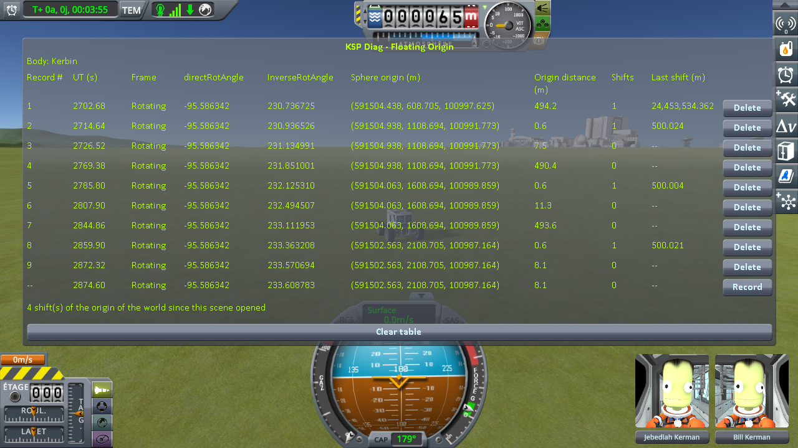
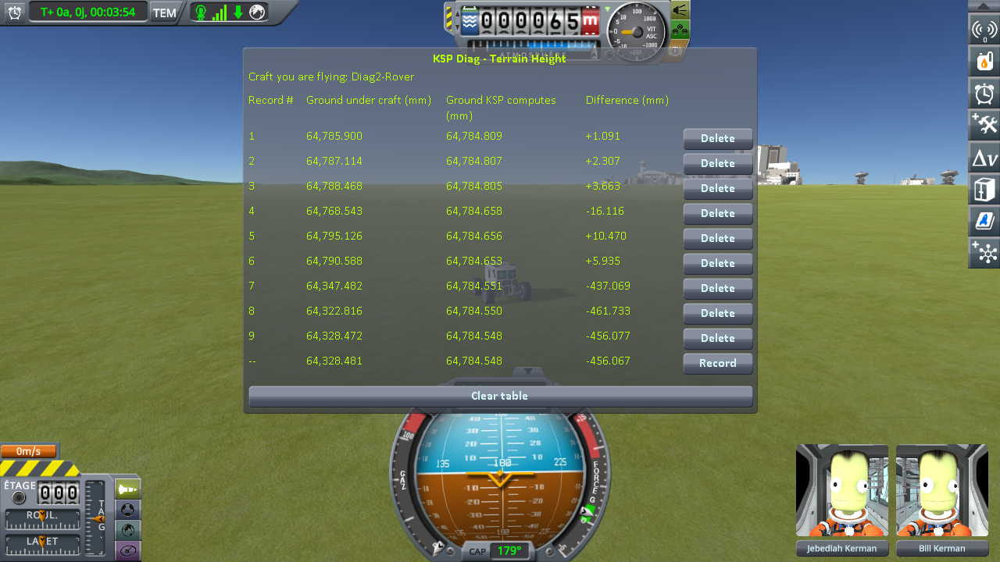
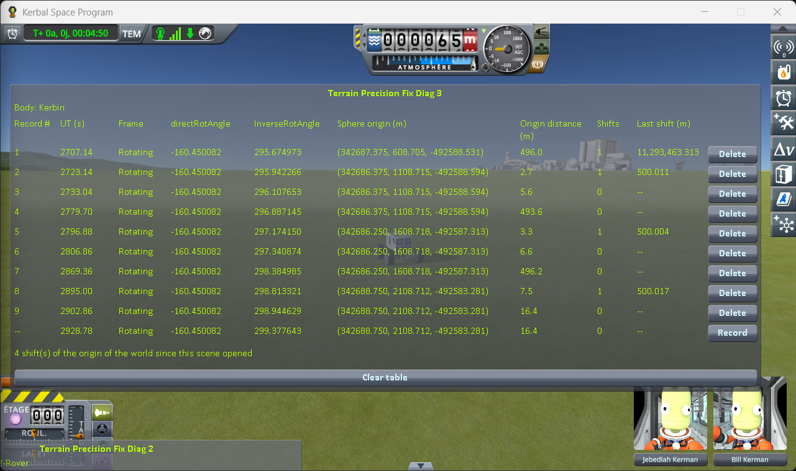
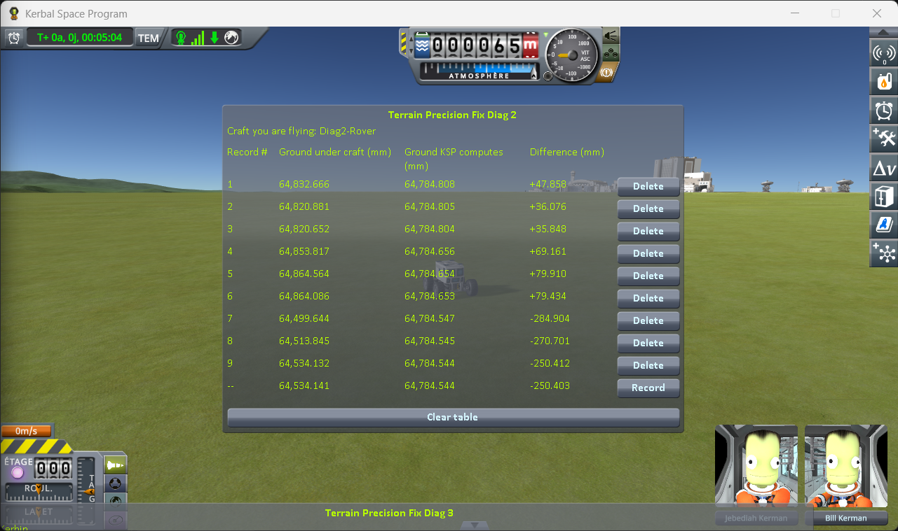
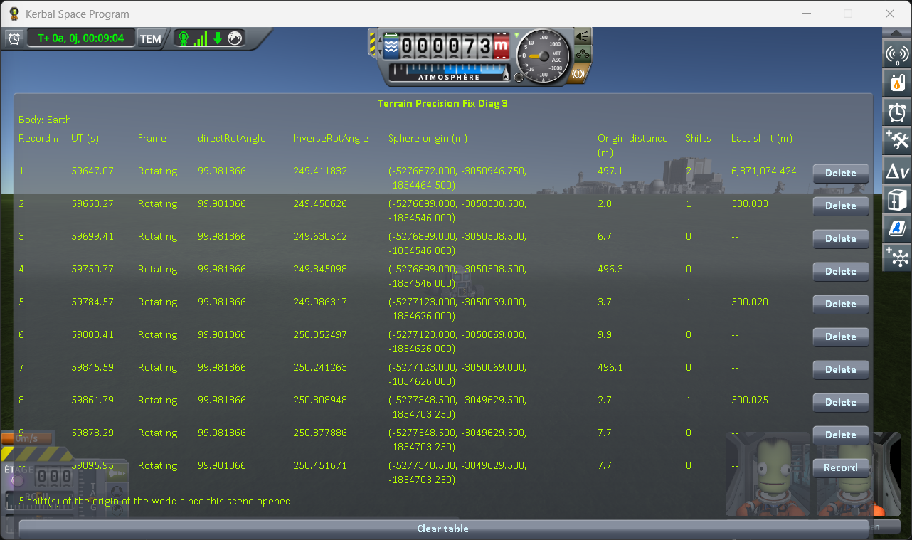
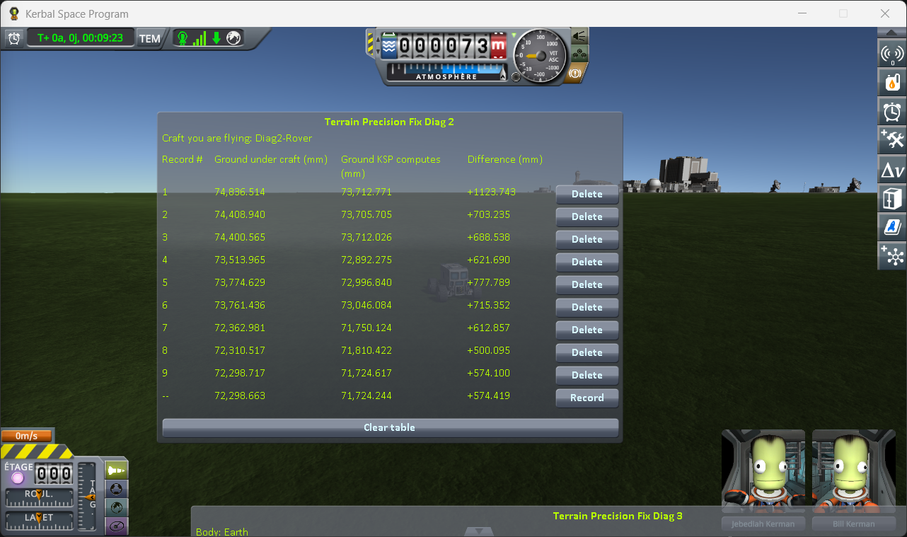
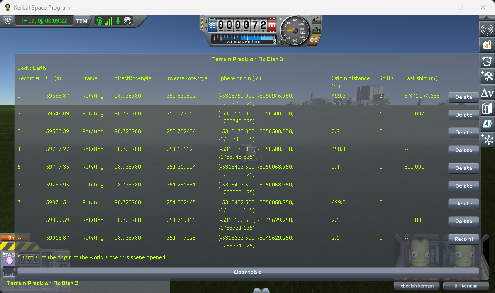
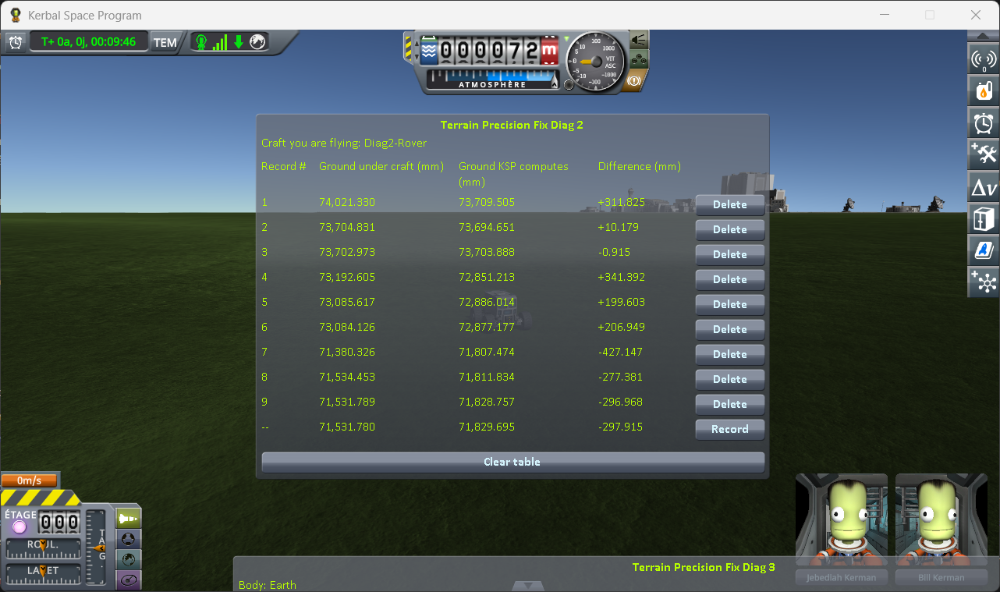

# The measurements: driving on while the world moves

Part of [Terrain Precision Fix Diag 2](../README.md): the readings taken with
[the driving protocol](the-protocol-driving.md) — a rover alone on the grass, read just before and
just after the game moves its whole world, then the same few metres farther on with no move. Nothing is
loaded at any point: from the first line to the last of a run, it is one single flight. The series runs
on Kerbin, then on Earth in Real Solar System, much larger. The other series are in
[The measurements: loading the same save](the-measurements-loading.md),
[The measurements: coming back to a craft you left](the-measurements-approach.md),
[The measurements: switching to a craft far away](the-measurements-switching.md) and
[The measurements: the runway and the grass beside it](the-measurements-runway.md).

The saves the protocol uses are [`diag/driving-kerbin.sfs`](../diag/driving-kerbin.sfs) and
[`diag/driving-earth-rss.sfs`](../diag/driving-earth-rss.sfs), and
[the protocol page](the-protocol-driving.md#the-save) says what they hold.

## The install

KSP 1.12.5 on Windows, with `GameData` holding Harmony, ModuleManager,
[KSP Community Fixes](https://github.com/KSPModdingLibs/KSPCommunityFixes) 1.41.1, this mod and
[Terrain Precision Fix Diag 3](https://github.com/lhervier/KSP-TerrainPrecisionFixDiag3), which only
reads, and nothing else. On Earth, that install with
[Real Solar System](https://github.com/KSP-RO/RealSolarSystem) 20.1.3.0 and what it requires added
(Kopernicus 1.12.1.248, Modular Flight Integrator, KSPTextureLoader, the RSS textures).

## The readings

Each run starts from the save and drives due south. On every line, Diag 3 confirms what the protocol
expects: 1 in **Shifts** on each line taken just after a move, with a **Last shift** of 500.0 m to
within five centimetres, and 0 on each line taken with no move — except the first line of a run, which
reads the moves the game makes as the scene opens: one on Kerbin, two on Earth.

A move is kept when its second line changes at least three times as much as its third
([the protocol](the-protocol-driving.md#what-the-three-lines-are-worth)). In *Difference*, in
millimetres.

### On Kerbin

Two runs, logged in [`diag/runs/driving-stock-1.log`](../diag/runs/driving-stock-1.log) and
[`driving-stock-2.log`](../diag/runs/driving-stock-2.log). On the three lines of each move kept,
**Ground KSP computes** reads the same digits to within seven thousandths of a millimetre: the three
lines are read on the same flat ground.

| run, move | line 1, just before | line 2, just after | line 3, same distance again | 1 → 2, across the move | 2 → 3, no move |
|---|---|---|---|---|---|
| 1, 1 | +98.195 | +93.998 | +95.164 | **−4.197** | +1.166 |
| 1, 2 | +110.705 | +99.013 | +98.273 | **−11.692** | −0.740 |
| 1, 3 | −292.737 | −283.149 | −283.140 | **+9.588** | +0.009 |
| 2, 1 | +47.858 | +36.076 | +35.848 | **−11.782** | −0.228 |
| 2, 2 | +69.161 | +79.910 | +79.434 | **+10.749** | −0.476 |

The first run, Diag 3 then Diag 2:

The second run, Diag 3 then Diag 2:

Two moves are in the screenshots and left out, both by their own third line:

- **the fourth move of the first run** (lines 10 to 12), about two kilometres south of the runway, where
  the ground slopes down: **Ground KSP computes** drops by 153 mm from line 10 to line 11 and by 291 mm
  from line 11 to line 12, and *Difference* changes by −70.0 mm across the move and by +175.7 mm with no
  move. That move is why [the protocol](the-protocol-driving.md#the-protocol) stops at three on Kerbin;
- **the third move of the second run** (lines 7 to 9): **Ground KSP computes** stays within three
  thousandths of a millimetre, but *Difference* changes by +14.203 mm across the move and by +20.289 mm
  with no move.

### On Earth

The ground around the KSC of Real Solar System is not flat to the millimetre: **Ground KSP computes**
changes by about a centimetre per metre. Two runs, logged in
[`diag/runs/driving-earth-rss-stock-1.log`](../diag/runs/driving-earth-rss-stock-1.log) and
[`driving-earth-rss-stock-2.log`](../diag/runs/driving-earth-rss-stock-2.log). In the first, the rover
stopped 2 to 4 m past each move and another 5 to 6 m on, and the third lines came out large; the second
stopped within 2 m, as the protocol now says. The first log opens with a load given up before its first
record, the 500 m passed without stopping; the run starts at the second load.

| run, move | line 1, just before | line 2, just after | line 3, same distance again | 1 → 2, across the move | 2 → 3, no move | kept |
|---|---|---|---|---|---|---|
| 1, 1 | +1123.743 | +703.235 | +688.538 | **−420.508** | −14.697 | yes |
| 1, 2 | +621.690 | +777.789 | +715.352 | +156.099 | −62.437 | no |
| 1, 3 | +612.857 | +500.095 | +574.100 | −112.762 | +74.005 | no |
| 2, 1 | +311.825 | +10.179 | −0.915 | **−301.646** | −11.094 | yes |
| 2, 2 | +341.392 | +199.603 | +206.949 | **−141.789** | +7.346 | yes |
| 2, 3 | −427.147 | −277.381 | — | +149.766 | — | no |

In the third move of the second run, line 9 of this mod was recorded without a line in Diag 3, at the
same **Origin distance** as line 8, and **Ground KSP computes** moved by 16.9 mm between them: the
rover had shifted where it stood, not driven 2 m on. That move has no third line, and is not kept.

**The rover was seen to jump** twice, at the second move of the first run and the third of the second:
the two moves where the ground under it rose, by 156 and 150 mm.

The first run, Diag 3 then Diag 2:

The second run, Diag 3 then Diag 2:

## What the readings say

**The ground moves when the world moves.** On Kerbin, across each of the five moves kept, *Difference*
changes by 4.2 to 11.8 mm, upwards or downwards; across the same few metres with no move, by 1.2 mm at
most. On Earth, across the three moves kept, by 142 to 421 mm; with no move, by 15 mm at most. The ground
under the rover moves in the middle of a drive, with nothing loaded, and on Earth enough for the rover to
jump when it rises.

**How far it moves is drawn afresh at every move**, so one move says little on its own. It is the series
that is worth reading, not a line.

**Line 7 of both runs on Kerbin reads almost 30 cm below the computed height** (−292.737 and
−284.904 mm), at the same spot, about a kilometre and a half south of the runway, where every other line
kept reads between +36 and +111 mm. This page does not explain it. It does not change the reading of the
move there in the first run, whose third line holds within nine thousandths of a millimetre.
