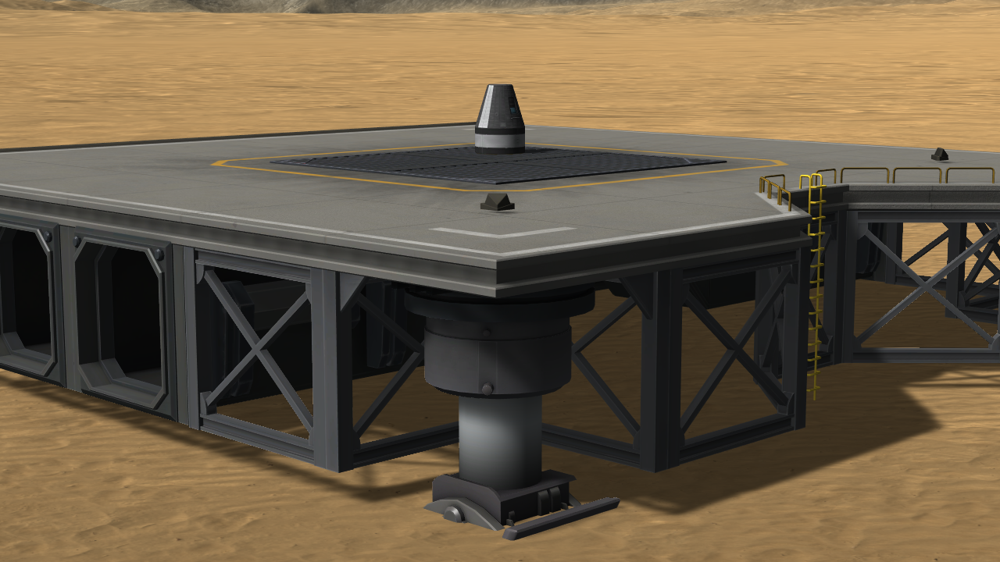
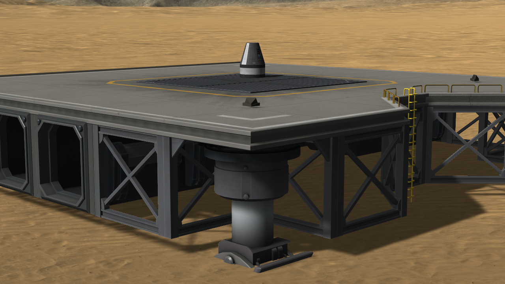
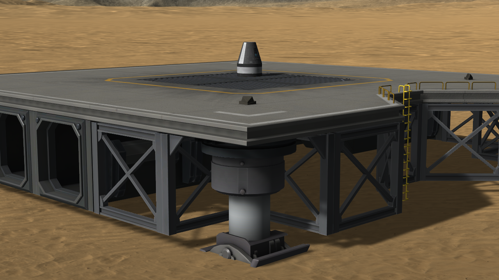
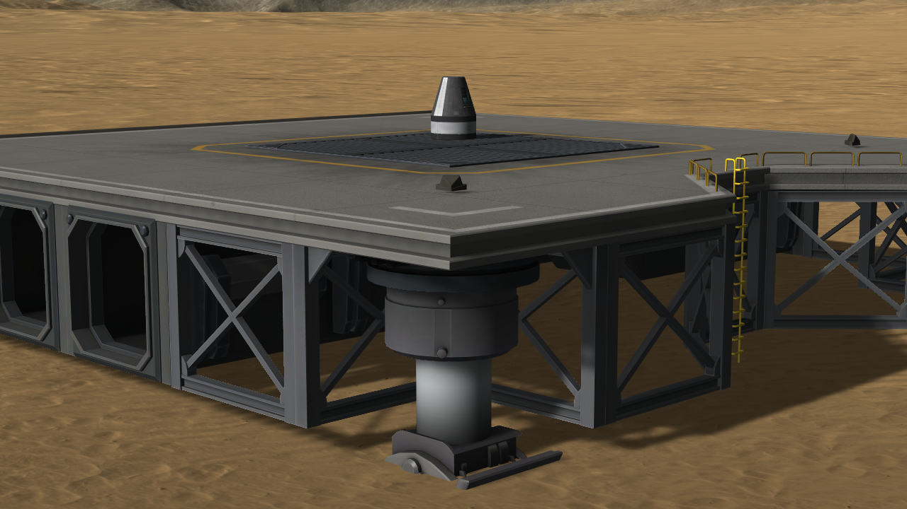
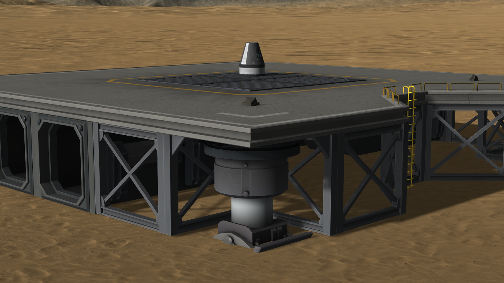
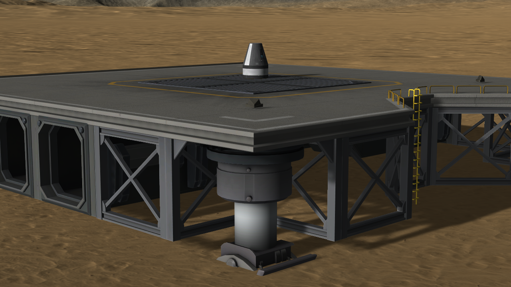

# The measurements: a launch pad of Making History

Part of [KSP Diag - Terrain Height](../README.md): the readings taken with
[the launch pad protocol](the-protocol-launch-pad.md) — a capsule launched from the Desert Launch Site of
the Making History expansion, in six sessions of the game, the deck under it read once in each.

The craft the protocol launches is [`craft/Capsule.craft`](../craft/Capsule.craft), and
[the protocol page](the-protocol-launch-pad.md#the-craft) says what it is.

## The install

KSP 1.12.5 on Windows with the Making History expansion, with `GameData` holding Harmony, ModuleManager,
[KSP Community Fixes](https://github.com/KSPModdingLibs/KSPCommunityFixes) 1.41.1, this mod and
[KSP-MCPServer](https://github.com/lhervier/KSP-MCPServer), which plays the protocol, and nothing else.

The series was played by [the script of the protocol](the-protocol-launch-pad.md#played-by-a-script),
`run-launch-pad.py`, one session of the game per launch.

## The readings

One line per launch, each in a session of its own. The table of the first launch:

**Ground KSP computes** reads 820,000.000 mm at all six launches: the ground the game flattens around the
launch site. **Ground under craft**, in millimetres, is the deck the capsule stands on:

| launch | Ground under craft | *Difference* |
|---|---|---|
| 1 | 824,329.019 | +4,329.019 |
| 2 | 824,329.019 | +4,329.019 |
| 3 | 824,260.216 | +4,260.216 |
| 4 | 824,329.019 | +4,329.019 |
| 5 | 823,736.212 | +3,736.212 |
| 6 | 824,329.019 | +4,329.019 |
| **lowest to highest** | **592.8 mm** | |

In five of the six sessions, `KSP.log` holds a line written by the launch pad as the craft was launched,
saying it moved itself up *so legs are above ground*: by 0.02490234 m in sessions 1, 2, 4 and 6, by
0.002441406 m in session 3. Session 5 has no such line.

**The feet of the launch pad**, the one nearest the camera, from the south-west of the capsule, at each
launch:

| | |
|---|---|
|  |  |
| launch 1 | launch 2 |
|  |  |
| launch 3 | launch 4 |
|  |  |
| launch 5 | launch 6 |

**→ What they show: [What the measurements show: a launch pad of Making History](what-the-measurements-show-launch-pad.md)**

## The logs

[`diag/runs/launch-pad-stock-1.log`](../diag/runs/launch-pad-stock-1.log) to
[`launch-pad-stock-6.log`](../diag/runs/launch-pad-stock-6.log) — the `KSP.log` of each of the six
sessions; what the script printed is in
[`launch-pad-stock-script.txt`](../diag/runs/launch-pad-stock-script.txt), and every line it recorded in
[`launch-pad-stock-lines.json`](../diag/runs/launch-pad-stock-lines.json).
