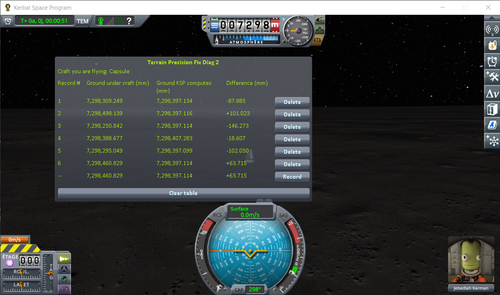
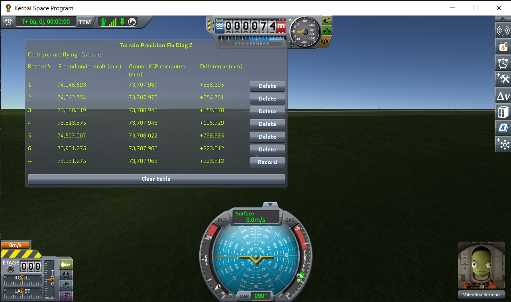

# The measurements: loading the same save

Part of [KSP Diag - Terrain Height](../README.md): the readings taken with this instrument, on the four worlds of stock KSP and on two much larger ones, the Moon and Earth of Real Solar System. The steps that produced them are in [The protocol: loading the same save](the-protocol-loading.md). The other series are in [The measurements: coming back to a craft you left](the-measurements-approach.md) and [The measurements: switching to a craft far away](the-measurements-switching.md).

The experiment is one thing, repeated. Park a craft on bare ground, let it settle, save once — then
load that same save, press *Record*, load it again, record again, and keep going until you have five
or six lines. Nothing changes in between: not the craft, not the spot, not the world. Every line is
the same question, asked again. (Step by step, with screenshots, in
[The protocol: loading the same save](the-protocol-loading.md).)

## The install

KSP 1.12.5 on Windows, with `GameData` holding Harmony, ModuleManager,
[KSP Community Fixes](https://github.com/KSPModdingLibs/KSPCommunityFixes) 1.41.1 and this mod, and
nothing else — what most players run, give or take their other mods.

The Moon and Earth are measured on an install of their own: the one above, plus
[Real Solar System](https://github.com/KSP-RO/RealSolarSystem) 20.1.3.0 and what it requires
(Kopernicus, Modular Flight Integrator, KSPTextureLoader, the RSS textures).
Real Solar System replaces the planets with the real ones: the Moon is more than three times the radius
of Kerbin, Earth more than ten times. It is installed as released, and it ships a workaround of its own
that moves landed craft at loading; what that does to the readings is in
[Real Solar System's own workaround](#real-solar-systems-own-workaround). The saves are in
[`diag`](../diag/README.md#on-real-solar-system); they only load there.

## The readings

On Kerbin first: one save, on a grassy slope some eight kilometres west of the KSC, loaded six times.

(The bottom line of the screenshot is the sixth loading, still live, not a seventh one. It carries
`--` instead of a number, since it is not a record until you freeze it.)

Then the same campaign on the Mun, on Minmus and on Gilly:

And on the Moon and Earth, with a capsule on an empty fuel tank: six loadings of
`reload-moon-rss-resave.sfs` on flat ground on the Moon, and six of `reload-earth-rss-resave.sfs` on
the grass about 1.4 km west of the KSC on Earth.

*Difference* is one column minus the other, so it carries the whole of the movement of either; the
six campaigns side by side on that column, in millimetres:

| loading | Kerbin | Mun | Minmus | Gilly | the Moon | Earth |
|---|---|---|---|---|---|---|
| 1 | +307.930 | −23.958 | −12.291 | +37.426 | −87.885 **(jumped)** | +338.605 |
| 2 | +199.797 | −29.285 | −14.912 | +40.165 | +101.023 | +354.781 |
| 3 | +255.620 | −38.925 | −15.107 | +39.150 | −146.273 | +159.878 **(jumped)** |
| 4 | +290.055 | −24.506 | −14.351 | +39.019 | −18.607 **(tipped over)** | +105.929 |
| 5 | +273.017 | −36.386 | −13.981 | +38.896 | −102.050 | +798.985 |
| 6 | +224.774 | −33.521 | −16.351 | +40.391 | +63.715 | +223.312 |
| **lowest to highest** | **108.1** | **15.0** | **4.1** | **3.0** | **247.3** | **693.1** |
| *the same, for* **Ground KSP computes** | *0.039* | *0.015* | *0.000* | *0.018* | *10.184* | *0.994* |

**(jumped)**, **(tipped over)**: what the craft was seen to do at that loading. A craft that tipped over
came to rest somewhere else, and the line was read there: on the Moon, *Ground KSP computes* reads
10 mm higher at the fourth loading than at the five others, which stay within 0.035 mm of each other.
The line stays between the lowest and the highest of the other five, so it does not change the spread
of *Difference*.

The sessions on the Moon and Earth are logged in [`diag/runs`](../diag/README.md#on-real-solar-system).

## Real Solar System's own workaround

**Real Solar System already moves landed craft at loading.** It ships a component,
`VesselGroundPositionEnhancer`, which runs the stock repositioning pass on every landed craft it
unpacks: a craft found more than 10 cm off the ground, inside it or above it, is moved onto it before
its physics starts, in one block, and `KSP.log` gets a `Moving Vessel` line. Under 10 cm, the pass
leaves the craft where it is. The component only acts on a *landed* craft. On Earth, near the KSC, the
craft is in the *prelaunch* situation instead, where the component does not run; there, stock KSP runs
the same pass on its own, at every loading.

**It moves the craft, not the ground this instrument reads.** The pass moves the craft straight up or
down, so the spot under it stays the same, and both heights are read at that spot. `KSP.log` shows the
pass at two of the six loadings on the Moon, the second and sixth (`Moving Vessel up` 0.216 and
0.178 m), and *Ground KSP computes* reads 7,298,397.116 and 7,298,397.114 mm there, the same point as
the third loading, where the craft was not moved, to within two thousandths of a millimetre. On Earth, stock's pass moved the craft up at the first, second, fifth
and sixth loadings (0.217, 0.234, 0.678 and 0.102 m), and *Ground KSP computes* stays there within
0.076 mm of the fourth loading, which it did not touch. What does move that column is a craft coming to
rest somewhere else: see [What the numbers say](#what-the-numbers-say).

What the craft itself does under that workaround — when it is moved, when it jumps, when it tips over,
and what happens with the workaround turned off — is measured by KSP Diag - Landed Vessel, in
[Real Solar System's own workaround](https://github.com/lhervier/KSP-Diag-LandedVessel/blob/main/docs/the-measurements-loading.md#real-solar-systems-own-workaround).

## What the numbers say

**Ground KSP computes never moves.** On the Minmus flats it reads `0.000` six times over, which is as
plain as this argument gets. Everywhere else it wanders by a few hundredths of a millimetre at most —
on ground that is not level, a craft that settles a hair to one side is asking for the height of a
slightly different point, and on a slope that shows. Nothing surprising in any of it. That height is
worked out from the formulas the world is made of, and reloading a save does not change the world. On
Real Solar System it moved more, for the same reason: on the Moon, the 10 mm all come from the fourth
loading, where the craft tipped over and came to rest elsewhere; on Earth, nearly all of its 0.994 mm
comes from the third loading, where the craft jumped and landed elsewhere.

**Ground under craft moves every time.** On Kerbin it lands somewhere else on each of the six lines,
over a range of ten centimetres, and on none of the six bodies does it come back to the same place:
3.0 mm on Gilly, 4.1 mm on Minmus, 15.0 mm on the Mun, 108.1 mm on Kerbin, then 247.3 mm on the Moon
of Real Solar System and 693.1 mm on its Earth. Smaller world, smaller spread — but it never goes away.

The bottom two rows of the table are the argument entire. The craft's save never changed and the spot
never changed, so nothing about that patch of ground was different from one loading to the next — and
yet one of the two heights held still while the other wandered, by two to three orders of magnitude
more, world after world — on the Moon, once the loading where the craft tipped over and was read
somewhere else is set aside. The one that moved is the one that is wrong, and it is the one that describes
the surface your landing legs actually touch: it was simply not built in the same place twice.

On Kerbin, *Difference* sits two to three hundred millimetres away from zero on every line. That
offset belongs to the spot, not to the loading: on uneven ground, the flat triangles the game collides
with miss the shape of the terrain by far more than on flat ground (see
[Why a correct reading is not zero](this-mods-demonstration.md#why-a-correct-reading-is-not-zero)).
That part is the same on every loading, so it does not reach the spread — only the part that moves
does.

Every figure above is read straight off the screenshots above it, and nothing here asks you to take
any of them on trust: reproducing them is what this mod is for.
