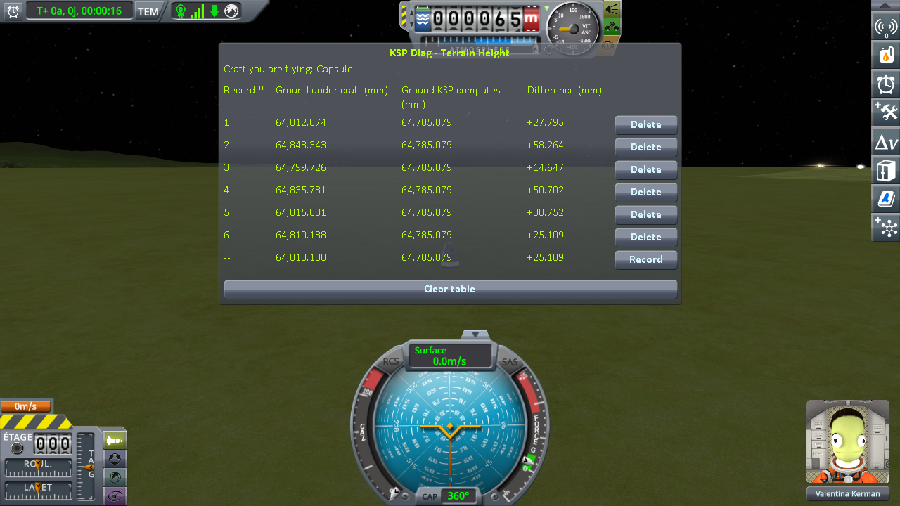
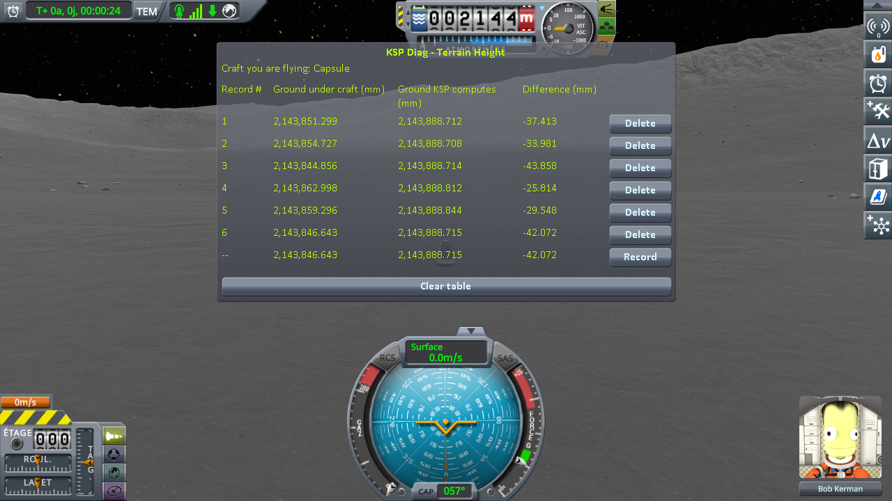
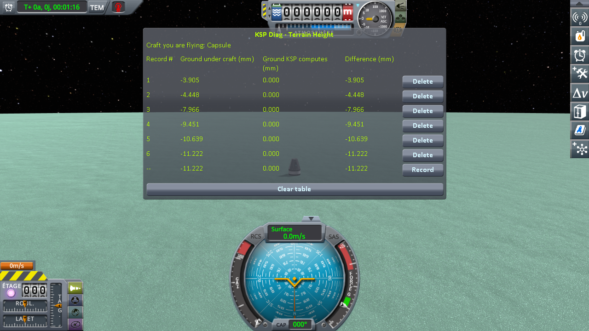
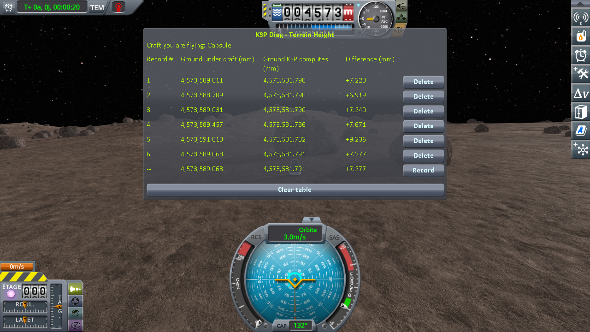
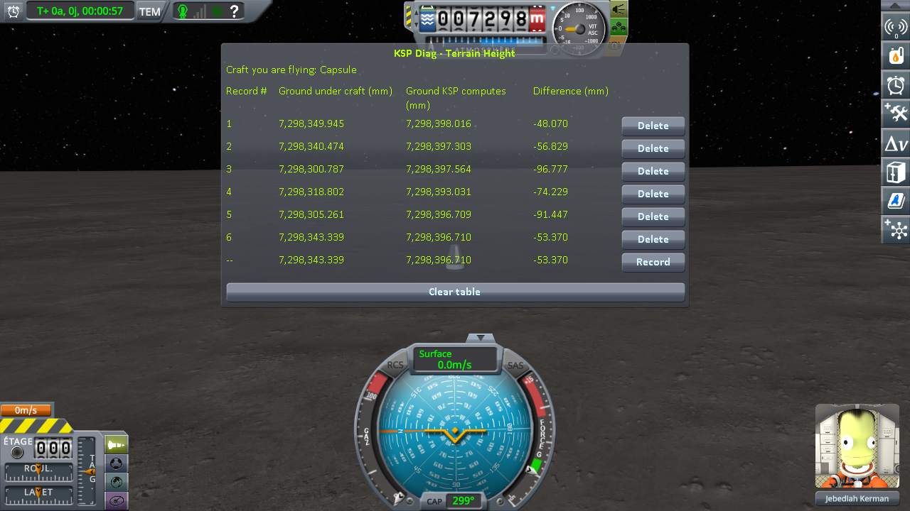
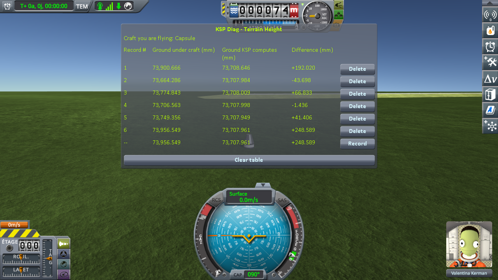

# The measurements: loading the same save

Part of [KSP Diag - Terrain Height](../README.md): the readings taken with this instrument, on the four worlds of stock KSP and on two much larger ones, the Moon and Earth of Real Solar System. The steps that produced them are in [The protocol: loading the same save](the-protocol-loading.md).

The experiment is one thing, repeated. Park a craft on bare ground, let it settle, save once — then
load that same save, press *Record*, load it again, record again, and keep going until you have five
or six lines. Nothing changes in between: not the craft, not the spot, not the world. Every line is
the same question, asked again. (Step by step, with screenshots, in
[The protocol: loading the same save](the-protocol-loading.md).)

## The install

KSP 1.12.5 on Windows, with `GameData` holding Harmony, ModuleManager,
[KSP Community Fixes](https://github.com/KSPModdingLibs/KSPCommunityFixes) 1.41.1, this mod,
[KSP Diag - Landed Vessel](https://github.com/lhervier/KSP-Diag-LandedVessel), which reads the craft
standing on the same ground at the same moments, and [KSP-MCPServer](https://github.com/lhervier/KSP-MCPServer),
which plays the protocol, and nothing else — what most players run, give or take their other mods.

The Moon and Earth are measured on an install of their own: the one above, plus
[Real Solar System](https://github.com/KSP-RO/RealSolarSystem) 20.1.3.0 and what it requires
(Kopernicus 248, Modular Flight Integrator, KSPTextureLoader, the RSS textures).
Real Solar System replaces the planets with the real ones: the Moon is more than three times the radius
of Kerbin, Earth more than ten times. It is installed as released, and it ships a workaround of its own
that moves landed craft at loading; what that does to the readings is in
[Real Solar System's own workaround](#real-solar-systems-own-workaround). The saves are in
[`diag`](../diag/README.md#on-real-solar-system); they only load there.

Every series on this page was played by
[the script of the protocol](the-protocol-loading.md#played-by-a-script), `run-loading.py`: one
session per install, every save of it loaded six times in a row, a *Record* in both instruments at each
loading, and a screenshot of the table after the sixth. The saves are in [`diag`](../diag/README.md#the-saves-of-the-loading-protocol);
the sessions, what the script printed and every line it recorded, in [`diag/runs`](../diag/README.md#the-runs-of-the-loading-protocol).

## The readings

One craft on every world, a capsule on a small flat fuel tank, set down on bare, flat ground. On Kerbin
first: one save, `reload-kerbin-2parts.sfs`, on the levelled grass of the KSC, just south-west of the
west end of the runway, loaded six times.

(The bottom line of the screenshot is the sixth loading, still live, not a seventh one. It carries
`--` instead of a number, since it is not a record until you freeze it.)

Then the same campaign on flat ground on the Mun, on the frozen flats of Minmus and on Gilly; and with
the same craft on the Moon and Earth, six loadings of `reload-moon-rss-resave.sfs` on flat ground on the
Moon, and six of `reload-earth-rss-resave.sfs` on the grass about 1.4 km west of the KSC on Earth.

*Difference* is one column minus the other, so it carries the whole of the movement of either; the six
campaigns side by side on that column, in millimetres:

| loading | Kerbin | Mun | Minmus | Gilly | the Moon | Earth |
|---|---|---|---|---|---|---|
| 1 | +27.795 | −37.413 | −3.905 | +7.220 | −48.070 | +192.020 |
| 2 | +58.264 | −33.981 | −4.448 | +6.919 | −56.829 | −43.698 *(moved down)* |
| 3 | +14.647 | −43.858 | −7.966 | +7.240 | −96.777 | +66.833 |
| 4 | +50.702 | −25.814 | −9.451 | +7.671 | −74.229 | −1.436 *(moved down)* |
| 5 | +30.752 | −29.548 | −10.639 | +9.236 | −91.447 | +41.406 |
| 6 | +25.109 | −42.072 | −11.222 | +7.277 | −53.370 | +248.589 *(moved up)* |
| **lowest to highest** | **43.6** | **18.0** | **7.3** | **2.3** | **48.7** | **292.3** |
| *the same, for* **Ground KSP computes** | *0.000* | *0.136* | *0.000* | *0.008* | *4.985* | *0.697* |

*(moved up)*, *(moved down)*: at that loading, `KSP.log` has a `Moving Vessel` line: the craft came
back more than 10 cm off the ground and was moved onto it before its physics started — see
[Real Solar System's own workaround](#real-solar-systems-own-workaround).

What stands on the ground does not change what this instrument reads: the craft only marks the spot
the ray is fired at. It has two parts for the sake of
[KSP Diag - Landed Vessel](https://github.com/lhervier/KSP-Diag-LandedVessel), which reads the craft
itself at the same moments: KSP sets a craft of a single part back onto the ground at every loading.

The sessions are logged in [`diag/runs`](../diag/README.md#the-runs-of-the-loading-protocol).

## Real Solar System's own workaround

**Real Solar System already moves landed craft at loading.** It ships a component,
`VesselGroundPositionEnhancer`, which runs the stock repositioning pass on every landed craft it
unpacks: a craft found more than 10 cm off the ground, inside it or above it, is moved onto it before
its physics starts, in one block, and `KSP.log` gets a `Moving Vessel` line. Under 10 cm, the pass
leaves the craft where it is. The component only acts on a *landed* craft. On Earth, near the KSC, the
craft is in the *prelaunch* situation instead, where the component does not run; there, stock KSP runs
the same pass on its own, at every loading.

**It moves the craft, not the ground this instrument reads.** The pass moves the craft straight up or
down, so the spot under it stays the same, and both heights are read at that spot. On Earth, `KSP.log`
shows stock's pass at the second, fourth and sixth loadings (`Moving Vessel down` 0.165 and 0.123 m,
`Moving Vessel up` 0.128 m), and *Ground KSP computes* reads 73,707.984, 73,707.998 and 73,707.961 mm
there, between the 73,707.949 and 73,708.009 mm of the fifth and third loadings, which it did not
touch. On the Moon, the component ran at all six loadings and never had to move the craft. What does
move that column is a craft coming to rest somewhere else: see [What the measurements show: loading the same save](what-the-measurements-show-loading.md).

What the craft itself does under that workaround — when it is moved, when it jumps, when it tips over,
and what happens with the workaround turned off — is measured by KSP Diag - Landed Vessel, in
[The ground workaround](https://github.com/lhervier/KSP-TerrainPrecisionFix/blob/main/docs/non-regression/real-solar-system/the-ground-workaround.md#reloading-until-something-happens), a page of Terrain Precision Fix.

**→ What they show: [What the measurements show: loading the same save](what-the-measurements-show-loading.md)**
