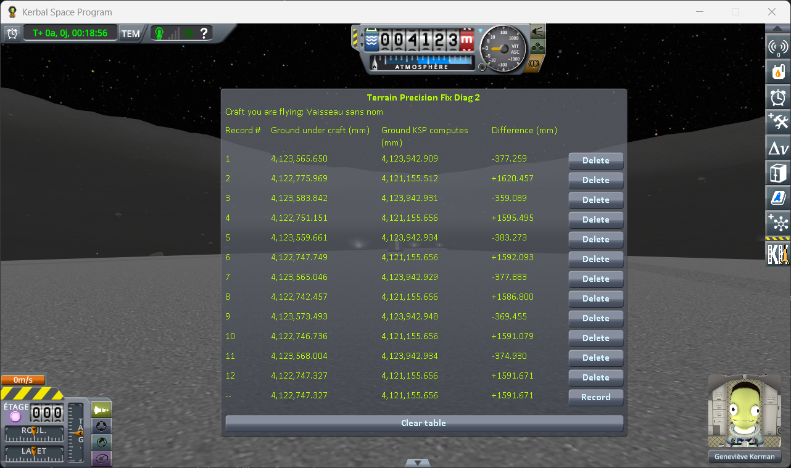

# The measurements: the runway and the grass beside it

Part of [KSP Diag - Terrain Height](../README.md): the readings taken with
[the runway protocol](the-protocol-runway.md) — one craft on the grass and one on the runway, 152 m
apart, the ground under both read at each of six loadings of the same save; then the same on the Mun,
beside a runway placed by a mod. The other series are in
[The measurements: loading the same save](the-measurements-loading.md),
[The measurements: coming back to a craft you left](the-measurements-approach.md) and
[The measurements: switching to a craft far away](the-measurements-switching.md).

The save the protocol uses is [`diag/runway-kerbin.sfs`](../diag/runway-kerbin.sfs), and
[the protocol page](the-protocol-runway.md#the-save) says what it holds. The Mun series uses
[`diag/runway-mun-kk.sfs`](../diag/runway-mun-kk.sfs) and the two files beside it.

## The install

KSP 1.12.5 on Windows, with `GameData` holding Harmony, ModuleManager,
[KSP Community Fixes](https://github.com/KSPModdingLibs/KSPCommunityFixes) 1.41.1 and this mod, and
nothing else. For the Mun, [Kerbal Konstructs](https://github.com/KSP-RO/Kerbal-Konstructs) 1.12.3 is
added, with CustomPreLaunchChecks 1.8.1, which it requires.

## The readings

Six loadings on each body, two lines each: the odd lines on the ground, the even lines on the runway,
after switching to it. The bottom line of each screenshot is the reading in progress, not a record.

**On Kerbin**, the runway of the KSC and the grass beside it:

**Ground KSP computes** reads 64,784.990 mm under the craft on the grass at all six loadings, and
64,785.047 mm under the craft on the runway. **Ground under craft**, in millimetres, and the step
between the two:

| loading | on the grass | on the runway | **step**: runway minus grass |
|---|---|---|---|
| 1 | 64,823.702 | 69,112.013 | 4,288.311 |
| 2 | 64,735.423 | 69,026.819 | 4,291.396 |
| 3 | 64,822.326 | 69,100.574 | 4,278.248 |
| 4 | 64,805.632 | 69,156.869 | 4,351.237 |
| 5 | 64,797.256 | 69,066.837 | 4,269.581 |
| 6 | 64,791.809 | 69,087.149 | 4,295.340 |
| **lowest to highest** | **88.3 mm** | **130.1 mm** | **81.7 mm** |

In *Difference*, the grass goes from −49.566 to +38.713 mm, the runway from +4,241.772 to +4,371.822 mm.

**On the Mun**, a runway placed by Kerbal Konstructs and the ground 42 m from it:

**Ground KSP computes** reads from 4,123,942.909 to 4,123,942.948 mm under the craft on the ground,
and 4,121,155.656 mm under the craft on the runway at all six loadings. **Ground under craft**, in
millimetres, and the step between the two:

| loading | on the ground | on the runway | **step**: runway minus ground |
|---|---|---|---|
| 1 | 4,123,565.650 | 4,122,775.969 | −789.681 |
| 2 | 4,123,583.842 | 4,122,751.151 | −832.691 |
| 3 | 4,123,559.661 | 4,122,747.749 | −811.912 |
| 4 | 4,123,565.046 | 4,122,742.457 | −822.589 |
| 5 | 4,123,573.493 | 4,122,746.736 | −826.757 |
| 6 | 4,123,568.004 | 4,122,747.327 | −820.677 |
| **lowest to highest** | **24.2 mm** | **33.5 mm** | **43.0 mm** |

In *Difference*, the ground goes from −383.273 to −359.089 mm, the runway from +1,586.800 to
+1,620.457 mm.

## What these readings show

**The height KSP computes does not move.** The same digits at all six loadings under both runways and
under the grass of Kerbin, four hundredths of a millimetre under the ground of the Mun. On a runway it is
the terrain under the deck, which the ray does not reach. Around the KSC the ground is flat, so the
height is nearly the same at both spots; on the Mun it slopes, so the deck stands 1.6 m above the
terrain KSP computes under it, and the ground the ray meets beside it 0.4 m below
([why a correct reading is not zero](this-mods-demonstration.md#why-a-correct-reading-is-not-zero)).

**The ground is somewhere else at every loading**, within 88.3 mm on Kerbin, as in
[the loading series](the-measurements-loading.md), and within 24.2 mm on the Mun: smaller, as the Mun
is in the loading series too.

**So is the runway deck**, within 130.1 mm on Kerbin and 33.5 mm on the Mun. A runway is a structure,
not the terrain, and it comes back at a different height every time just the same.

**The runway and the ground do not move together.** The step between them is never the same twice: it
spreads over 81.7 mm on Kerbin, 43.0 mm on the Mun. The ray is fired at the same two spots at every
loading, so if the runway kept the same height relative to the ground beside it, that step would not
move, flat ground or not.

**Whether the game or a mod places it, a structure behaves the same.** The runway of the KSC, which the
game puts in place, and a runway Kerbal Konstructs puts on another body both come back at a different
height every time, and neither keeps its height relative to the ground next to it.

## The logs

[`diag/runs/runway-stock.log`](../diag/runs/runway-stock.log) — the `KSP.log` of the session the six
loadings on Kerbin were taken in.

[`diag/runs/runway-mun-kk-stock.log`](../diag/runs/runway-mun-kk-stock.log) — the `KSP.log` of the
session the six loadings on the Mun were taken in.
