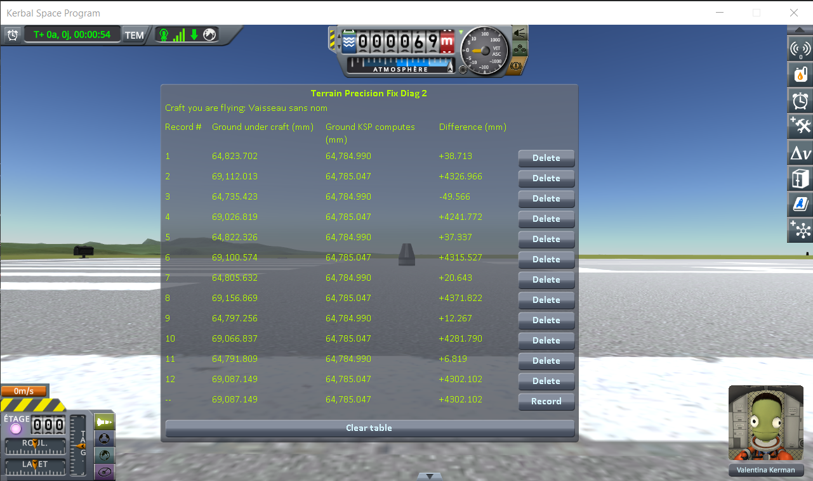

# The measurements: the runway and the grass beside it

Part of [Terrain Precision Fix Diag 2](../README.md): the readings taken with
[the runway protocol](the-protocol-runway.md) — one craft on the grass and one on the runway, 152 m
apart, the ground under both read at each of six loadings of the same save. The other series are in
[The measurements: loading the same save](the-measurements-loading.md),
[The measurements: coming back to a craft you left](the-measurements-approach.md) and
[The measurements: switching to a craft far away](the-measurements-switching.md).

The save the protocol uses is [`diag/runway-kerbin.sfs`](../diag/runway-kerbin.sfs), and
[the protocol page](the-protocol-runway.md#the-save) says what it holds.

## The install

KSP 1.12.5 on Windows, with `GameData` holding Harmony, ModuleManager,
[KSP Community Fixes](https://github.com/KSPModdingLibs/KSPCommunityFixes) 1.41.1 and this mod, and
nothing else.

## The readings

Six loadings, two lines each: the odd lines on the grass, the even lines on the runway, after
switching to it. The bottom line of the screenshot is the reading in progress, not a record.

**Ground KSP computes** reads 64,784.990 mm under the craft on the grass at all six loadings, and
64,785.047 mm under the craft on the runway. **Ground under craft**, in millimetres, and the step
between the two:

| loading | on the grass | on the runway | **step**: runway minus grass |
|---|---|---|---|
| 1 | 64,823.702 | 69,112.013 | 4,288.311 |
| 2 | 64,735.423 | 69,026.819 | 4,291.396 |
| 3 | 64,822.326 | 69,100.574 | 4,278.248 |
| 4 | 64,805.632 | 69,156.869 | 4,351.237 |
| 5 | 64,797.256 | 69,066.837 | 4,269.581 |
| 6 | 64,791.809 | 69,087.149 | 4,295.340 |
| **lowest to highest** | **88.3 mm** | **130.1 mm** | **81.7 mm** |

In *Difference*, the grass goes from −49.566 to +38.713 mm, the runway from +4,241.772 to +4,371.822 mm.

## What these readings show

**The height KSP computes never moves.** The same digits at all six loadings, at both spots — and
nearly the same at both, since the ground around the KSC is flat. On the runway it is the terrain
under the deck, which the ray does not reach.

**The grass is somewhere else at every loading**, within 88.3 mm, as in
[the loading series](the-measurements-loading.md).

**So is the runway deck, within 130.1 mm.** The runway is a structure, not the terrain, and it comes
back at a different height every time just the same.

**The two do not move together.** The step between the grass and the runway deck is never the same
twice: it spreads over 81.7 mm. The runway and the ground beside it do not keep their heights relative
to each other.

## The logs

[`diag/runs/runway-stock.log`](../diag/runs/runway-stock.log) — the `KSP.log` of the session the six
loadings were taken in.
