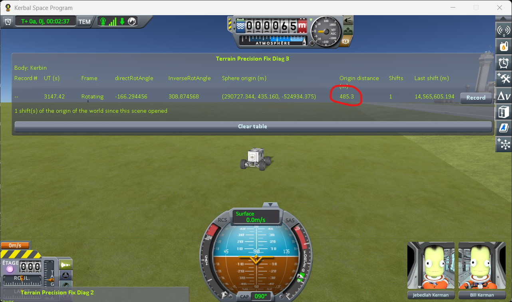
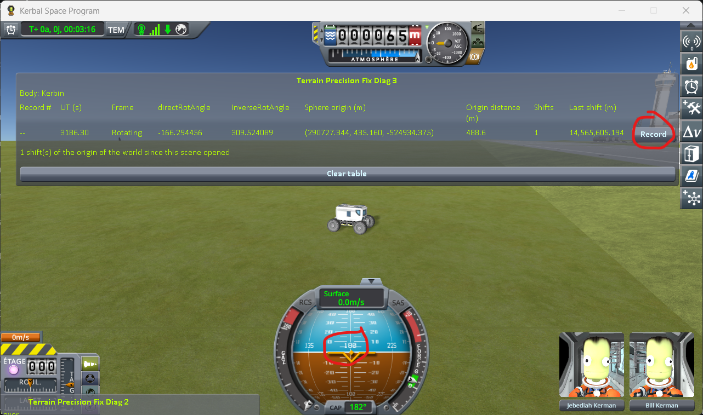
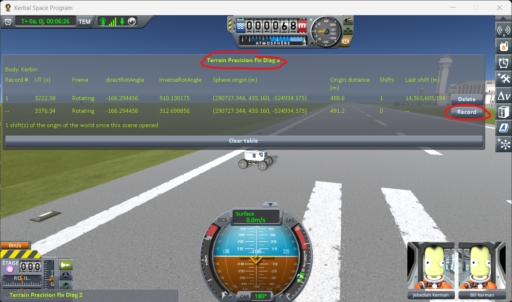
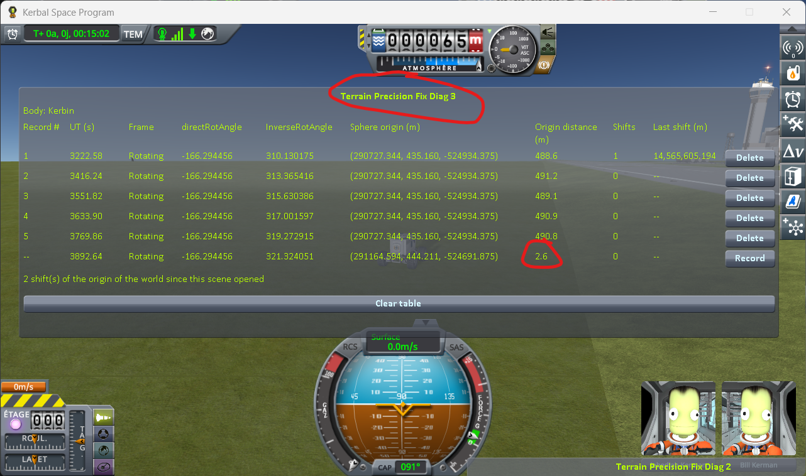
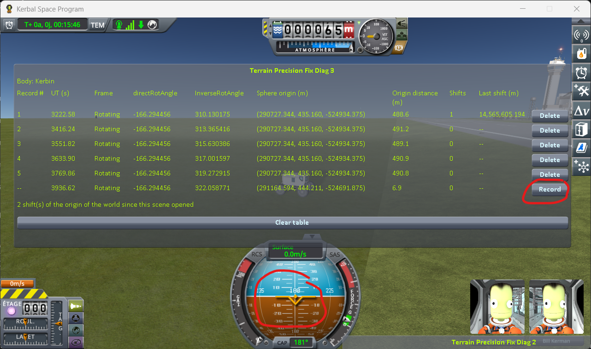

# The protocol: the runway and the grass, while the world moves

Part of [Terrain Precision Fix Diag 2](../README.md): how to read the runway deck and the grass beside
it, at the same two spots, just before and just after the game moves its whole world. Nothing is loaded
here — from the first line to the last, it is one single flight. The columns it fills are in
[The window](the-window.md), and what it reads is in
[The measurements: the runway and the grass, while the world moves](the-measurements-driving-runway.md).

It joins two other protocols. [The protocol: driving on while the world moves](the-protocol-driving.md)
reads the grass under a rover across a move of the world; its two instruments and the way it tells a
move from what a few metres do are the same here.
[The protocol: the runway and the grass beside it](the-protocol-runway.md) reads the deck and the grass
at every loading, with two craft.

This protocol asks whether the runway moves when the world moves, and whether it moves with the ground
beside it. It cannot use two craft: while another landed craft is loaded, the game does not move the
world at all (`Krakensbane.SafeToEngage`, and
[Diag 3, case 3](https://github.com/lhervier/KSP-TerrainPrecisionFixDiag3/blob/master/docs/the-measurements.md#case-3-a-rover-near-a-parked-craft-then-on-its-own)),
whether that craft stands still or rolls. So a single rover reads both spots in turn: before the move,
then after it. Once the world has moved, its origin is on the rover, so the rover can drive back a few
tens of metres to the two spots without moving it again.

It can be played by hand, or by a script that drives the rover for you
([Played by a script](#played-by-a-script)). The script is the one to trust for numbers: it parks the
rover on the same spot to within a centimetre, which a player cannot do.

## The two spots

- **G**, on the grass, off the edge of the runway: the ray reads the ground. Not on the bank that rises
  to the deck: on the flat grass, **Difference** reads a few millimetres; on the bank, tens.
- **P**, on the deck, a few metres in from the same edge: the ray reads the runway, a structure the game
  places its own way, several metres above the height it computes for the ground underneath. The
  **Difference** of a line taken there reads thousands of millimetres, which tells you the ray met the
  deck.

**Both spots have to be found again exactly**, before and after the move. The lines taken twice before
the move show how closely you come back to each spot, but not whether the spots after the move are the
same ones: the rover comes back to them from elsewhere. That is the weak point of the protocol played by
hand. Played by hand, it read the step between the deck and the grass changing by centimetres across a
move, where the script, parking on the same spots, finds no change at all.

## The save

[`driving-runway-kerbin.sfs`](../diag/driving-runway-kerbin.sfs) holds
[`Diag2-Rover`](../craft/Diag2-Rover.craft) alone, on the grass by the north edge of the runway of the
KSC, near its western end, at latitude −0.0416°, longitude −74.7263°, facing east. No target is set.

[`driving-runway-earth-rss.sfs`](../diag/driving-runway-earth-rss.sfs) is the same on Earth, in Real
Solar System: the rover alone on the grass by the north edge of the runway of the KSC at Cape Canaveral,
near its western end, about 65 m north of its axis, at latitude 28.6134°, longitude −80.6175°, facing
east. Real Solar System has to be built without its runway fix, which keeps the floating origin from
moving at 500 m once a craft has rolled onto the deck: see
[The measurements, on Earth](the-measurements-driving-runway.md#on-earth).

The rover is alone, and has to be, for the reason above.

You can make your own: launch the rover from the Spaceplane Hangar onto the runway, drive off it to the
north, then turn east along its edge. North, because the buildings of the KSC stand along the south
edge, in the way. Stop, put the brakes on, and save once.

## The protocol

Load the save and **do not change scene again** — no save, no load, no trip back to the space centre.
Every record is taken in both windows, this mod's and Diag 3's, as in
[the driving protocol](the-protocol-driving.md#two-instruments).

Then, for each move of the world:

**1. Drive east along the edge**, on the grass, until **Origin distance** in Diag 3 reads about 480 m.

**2. The two spots, before the move.** Turn to face the runway: G is where you stand. Record at G, then
drive onto the deck — P — and record there. Then back to G, record; P, record; and G once more, record.
Diag 3 reads 0 on each of these lines, but the first line of a series, which reads the move the game
makes as the scene opens.

**3. Past the move.** Drive on, east, until **Origin distance** drops back near zero: the world has
moved. Stop; no record here.

**4. The two spots, after the move.** Drive back to G, record; P, record; G, record; P, record. Diag 3
reads 1 on the first of these lines and 0 on the others.

Then drive on to the next move and do it again. **Two moves, and no more**: past the second, about
1.5 km east of the save, the grass beside the runway is no longer flat, and the readings at a spot
before the move already differ from one visit to the next.

⚠️ **Do not save while the series is running.** The readings are only comparable if they are all taken
in the one flight the save opened.

## What the nine lines are worth

| lines | where | what they are worth |
|---|---|---|
| 1 to 5 | G, P, G, P, G, before the move | each spot before the move, read two or three times: how closely you come back to it |
| 6 to 9 | G, P, G, P, after the move | each spot after the move, read twice |

**At each spot, read the change across the move** — the mean of its lines after the move minus the mean
of its lines before — **against the spread of its lines on either side.** A spot counts when the change
is at least three times that spread, as in
[the driving protocol](the-protocol-driving.md#what-the-three-lines-are-worth).

**Then read the two spots together.** If the runway only follows the ground, the deck and the grass move
by the same amount, and the step between them — **Difference** at P minus **Difference** at G — stays
what it was. If the step changes across the move by much more than the spread, the runway and the
ground each moved on their own.

**One move says nothing on its own.** It is the series that is worth reading, not a line.

## Played by a script

[`diag/automation/run-driving-runway.py`](../diag/automation/run-driving-runway.py) plays the protocol
above, step for step, and takes the screenshots. It drives KSP through
[KSP-MCPServer](https://github.com/lhervier/KSP-MCPServer), a mod that answers requests sent to it over
HTTP, from the computer KSP runs on only; and it needs nothing but Python 3 — no AI, no package to
install. Anyone can read it top to bottom: it follows the four steps above in the same order.

1. Install KSP-MCPServer next to this mod and Diag 3, copy the save into a sandbox game, start KSP and
   wait for the main menu.
2. Run `python run-driving-runway.py --folder <your sandbox game> --moves 2 --out screenshots`. On
   Earth, add `--save driving-runway-earth-rss --radius 6371000`: the radius of the body turns the
   metres between the spots into degrees.

It loads the save, then for each move: drives east until the origin of the world is about 455 m away,
turns south, puts G on the flat grass 12 m north of where the turn ends and P on the deck 52 m south of
G, and drives between them in a straight line, forward and in reverse. It waits for the digits to stop
moving before each record (within a hundredth of a millimetre over three seconds), records in both
windows, and takes a screenshot of each table after each move. It prints every line it records, writes
them to `lines.json` next to the screenshots, and quits KSP at the end — give it `--keep-running` to
leave KSP open. Save `KSP.log` before starting KSP again: KSP writes it anew at every start.

It parks the rover 13 to 15 cm from each spot, at the same place to within a millimetre from one visit
to the next: the lines taken twice at a spot agree to a few hundredths of a millimetre, before the move
and after it.
