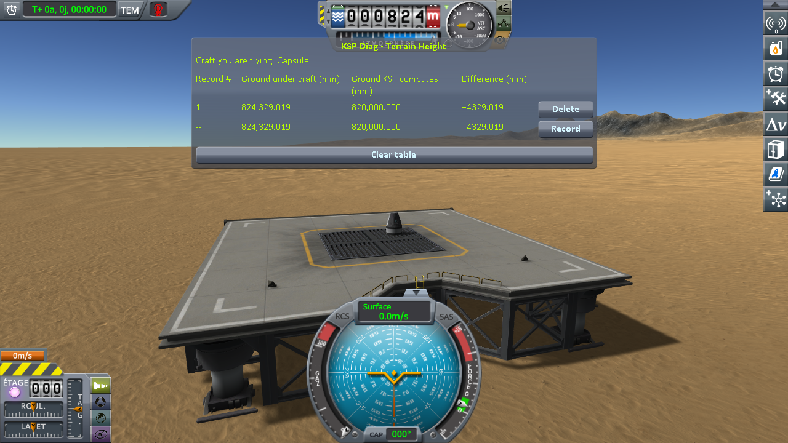

# The protocol: a launch pad of Making History

Part of [KSP Diag - Terrain Height](../README.md): how to read the deck of a launch pad of the Making
History expansion under a craft launched from it. The columns it fills are in [The window](the-window.md),
and the readings it produced are in
[The measurements: a launch pad of Making History](the-measurements-launch-pad.md).

The Desert Launch Site, one of the launch sites the Making History expansion adds on Kerbin, is a deck on
four legs. The game sets it on the ground when a craft is launched from it, and only once in a session of
the game: it lifts the deck if one of its feet is under the ground, then stretches its legs down to the
ground. So this protocol launches a craft from it in several sessions of the game, and reads the ground
under the craft each time: the ray, fired from above the craft, stops on the deck the craft stands on.

## The craft

[`Capsule.craft`](../craft/Capsule.craft), a Mk1 command pod on an FL-T100 tank, built in the Vehicle
Assembly Building of KSP 1.12.5. Copy it into the `Ships/VAB` folder of a sandbox game. The Making
History expansion must be installed: the Desert Launch Site is one of its launch sites.

## The protocol

**1. Start KSP and open the sandbox game.** If it is night at the launch site, let time pass at the
space centre: the feet of the launch pad are looked at in daylight.

**2. In the Vehicle Assembly Building, load the craft, choose the Desert Launch Site as the launch
site, and launch.** Wait for the digits to stop moving, then press *Record*.

**3. Look at a foot of the launch pad**, where it meets the ground.

**4. Quit KSP**, then repeat steps 1 to 3 — six times in all, one line each time. Within one session,
the launch pad keeps the legs it set at its first launch, and a second launch from it reads the same
deck again.

One launch says nothing on its own: it is the series that is worth reading, not a line.

## Played by a script

[`diag/automation/run-launch-pad.py`](../diag/automation/run-launch-pad.py) plays the protocol above,
step for step, and takes the screenshots. It drives KSP through
[KSP-MCPServer](https://github.com/lhervier/KSP-MCPServer), a mod that answers requests sent to it over
HTTP, from the computer KSP runs on only; and it needs nothing but Python 3 — no AI, no package to
install. Anyone can read it top to bottom: it follows the four steps above in the same order.

1. Install KSP-MCPServer next to this mod, in a KSP that has the Making History expansion. Copy
   [the craft](../craft/Capsule.craft) into the `Ships/VAB` folder of a sandbox game. Make sure KSP is
   not running: the script starts it and quits it for each launch.
2. Run `python run-launch-pad.py --ksp <the folder of KSP> --folder <your sandbox game> --launches 6
   --out screenshots`.

For each launch, it starts KSP and waits for the main menu, opens the game, sets a time of day in
daylight at the launch site — 317 seconds later at each launch — and launches the craft from the
Desert Launch Site, as the Launch button of the editor does. It waits three seconds and for **Ground under craft** to
stop moving (within half a thousandth of a millimetre over two seconds), records, takes a screenshot of
the table and one of the nearest foot of the launch pad, then quits KSP and keeps its `KSP.log`, which
KSP writes anew at every start. It prints every line it recorded and writes them to `lines.json` next to
the screenshots.
