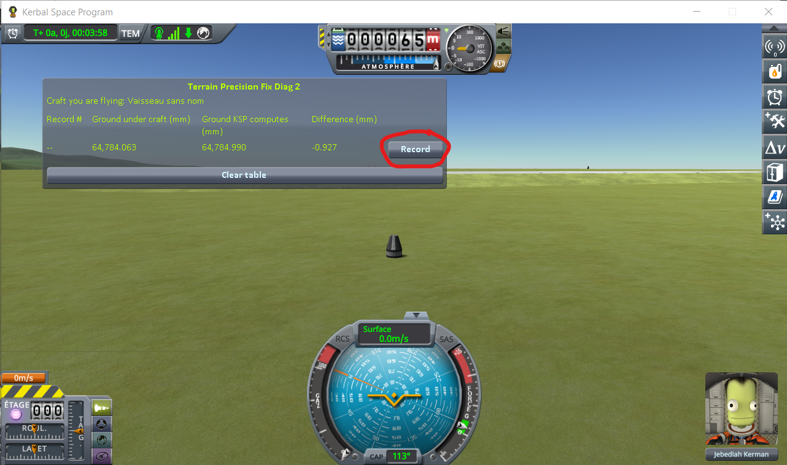
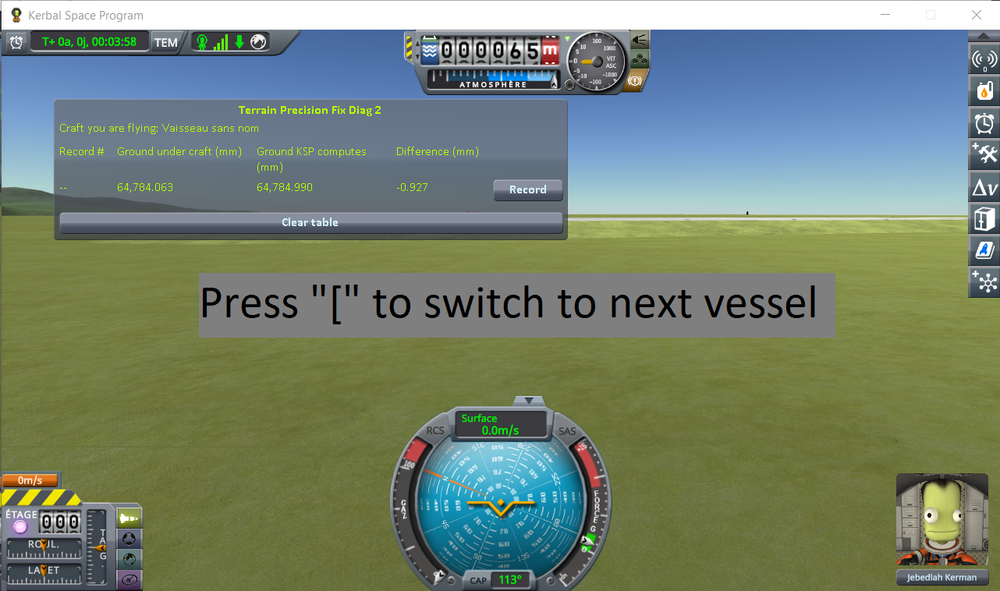
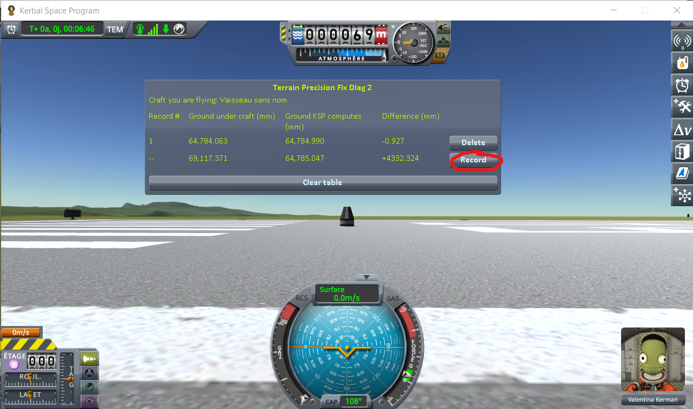

# The protocol: the runway and the grass beside it

Part of [Terrain Precision Fix Diag 2](../README.md): how to read the runway itself, where
[the loading protocol](the-protocol-loading.md) tells you not to fire the ray. The columns it fills are
in [The window](the-window.md), and the readings it produced are in
[The measurements: the runway and the grass beside it](the-measurements-runway.md).

The ray is fired from above the craft and stops at the first surface it meets. On the runway, that is
the deck, a structure the game puts in place its own way, four metres above the ground it computes
underneath. So this protocol parks one craft on the runway and another on the grass beside it, and reads
under both at every loading: the runway deck on one side, the terrain on the other, and the step
between the two.

## The save

[`runway-kerbin.sfs`](../diag/runway-kerbin.sfs), a sandbox game of KSP 1.12.5. Copy it into the
folder of a sandbox game and load it from that game. It holds two identical craft, each a Mk1 command
pod on an empty FL-T100 tank:

- **on the grass**, landed at latitude −0.0629°, longitude −74.7277°. It is the craft you are flying
  when the save opens;
- **on the runway**, 152 m away, where the game puts a craft launched from the Spaceplane Hangar:
  latitude −0.0488°, longitude −74.7243°.

No target is set. Keep it that way: the window reads under the target when there is one, and every line
would then read the same spot.

You can make your own instead: launch a craft from the Spaceplane Hangar, move it onto the grass beside
the runway with `Alt+F12 → Cheats → Set Position`, launch a second one and leave it on the runway, then
save once.

## The protocol

**1. Load the save.** You are flying the craft on the grass. Wait for the digits to stop moving, then
press *Record*.

**2. Switch to the craft on the runway** with `[`, one of the game's two default *switch vessel* keys.

Wait for the digits to stop moving, then press *Record*.

**3. Load the same save again**, and repeat steps 1 and 2 — six times in all, two lines each time,
always in the same order.

⚠️ **Never save over the save you load.** Every loading must start from that same save.

One loading says nothing on its own: it is the series that is worth reading, not a line.
