# The protocol: the runway and the grass beside it

Part of [KSP Diag - Terrain Height](../README.md): how to read the runway itself, where
[the loading protocol](the-protocol-loading.md) tells you not to fire the ray. The columns it fills are
in [The window](the-window.md), and the readings it produced are in
[The measurements: the runway and the grass beside it](the-measurements-runway.md).

The ray is fired from above the craft and stops at the first surface it meets. On the runway, that is
the deck, a structure the game puts in place its own way, four metres above the ground it computes
underneath. So this protocol parks one craft on the runway and another on the grass beside it, and reads
under both at every loading: the runway deck on one side, the terrain on the other, and the step
between the two.

## The save

[`runway-kerbin.sfs`](../diag/runway-kerbin.sfs), a sandbox game of KSP 1.12.5. Copy it into the
folder of a sandbox game and load it from that game. It holds two identical craft, each a Mk1 command
pod on an empty FL-T100 tank:

- **on the grass**, landed at latitude −0.0629°, longitude −74.7277°. It is the craft you are flying
  when the save opens;
- **on the runway**, 152 m away, where the game puts a craft launched from the Spaceplane Hangar:
  latitude −0.0488°, longitude −74.7243°.

No target is set. Keep it that way: the window reads under the target when there is one, and every line
would then read the same spot.

You can make your own instead: launch a craft from the Spaceplane Hangar, move it onto the grass beside
the runway with `Alt+F12 → Cheats → Set Position`, launch a second one and leave it on the runway, then
save once.

### The same on the Mun, with a runway placed by a mod

[`runway-mun-kk.sfs`](../diag/runway-mun-kk.sfs) holds the same two craft on the Mun, beside a runway
placed there by [Kerbal Konstructs](https://github.com/KSP-RO/Kerbal-Konstructs) 1.12.3, the mod players
use to add bases of their own. The runway is the one of the KSC, which the mod offers as a model.

The save alone does not hold the runway: Kerbal Konstructs keeps it in two files of its own. Install
Kerbal Konstructs and what it requires, copy the `GameData` folder of
[`diag/runway-mun-kk/`](../diag/runway-mun-kk/GameData/KerbalKonstructs/NewInstances/) into the folder
of KSP so that it merges with the `GameData` there, then copy and load the save as above. It holds:

- **on the ground**, landed at latitude −0.0662°, longitude −74.2867°. It is the craft you are flying
  when the save opens;
- **on the runway**, 42 m away: latitude −0.0603°, longitude −74.2973°.

The ground there is not flat, so the step between the two spots is not the height of the runway deck.
It does not need to be: the ray is fired at the same two spots at every loading, and the step would stay
the same if nothing moved.

To make your own, with the captures below taken in a game set to French:

1. **Launch the craft from the Spaceplane Hangar** and turn SAS on, so that it keeps upright when it is
   moved.

   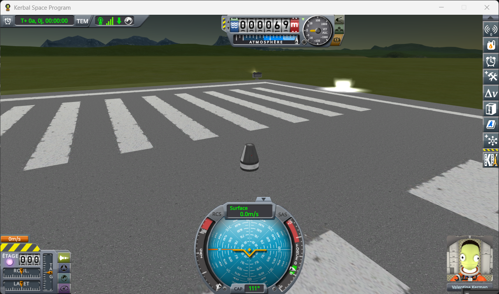

   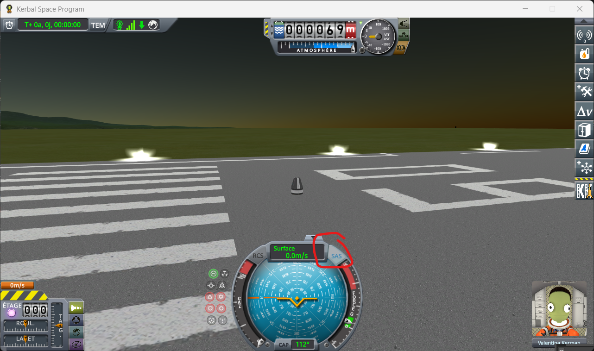

2. **Move it to the Mun** with `Alt+F12 → Cheats → Set Position`: the Mun, latitude −0.23, longitude
   −75, pitch 90, and tick the two boxes that let a middle click set the position and skip the safety
   checks. Once it has landed, turn SAS off.

   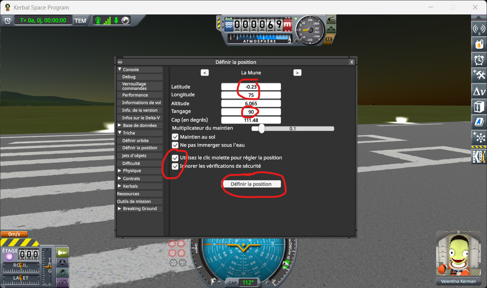

   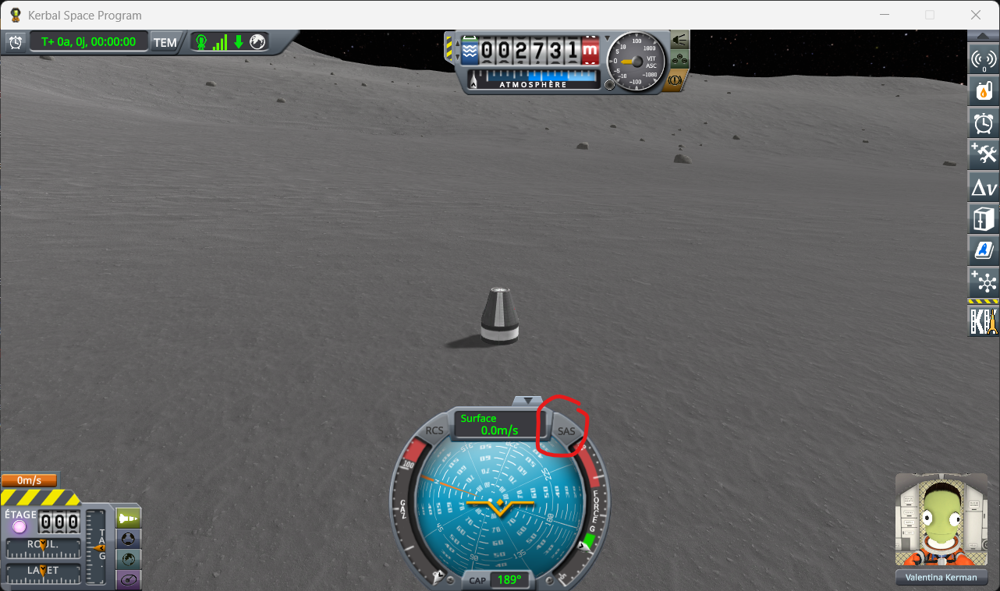

3. **Create a group** where the craft is: open the statics editor of Kerbal Konstructs with `Ctrl+K`,
   then *Edit Groups*, *Spawn new Group*, and *Save&Close* in the *Group Editor* that opens. Make it the
   active group with *Set Active Group*: pick it in the list and press *OK*. That list may open at the
   bottom edge of the screen; drag it up by its title.

   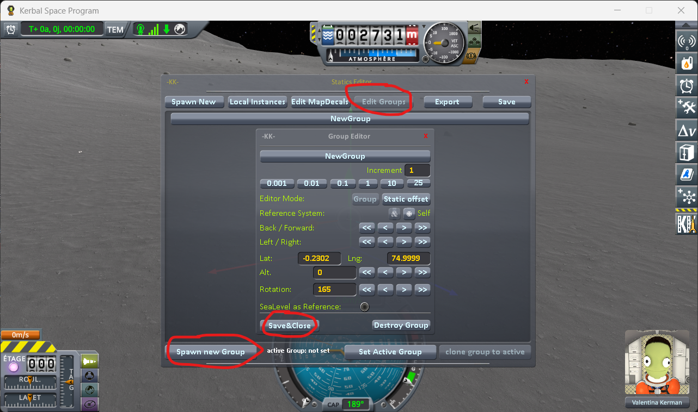

   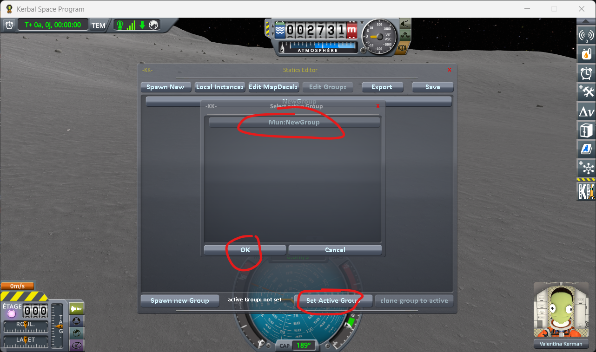

4. **Place the runway**: under *Spawn New*, click the title *KSC Runway lv 3* — the title, not the mesh
   name on the right, which opens the model's own settings. The runway appears on the craft: drag one of
   its arrows until the craft stands on the ground beside it, then *Save&Close*.

   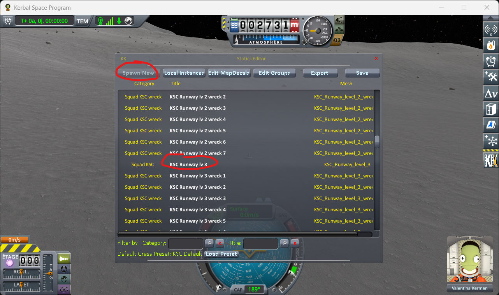

   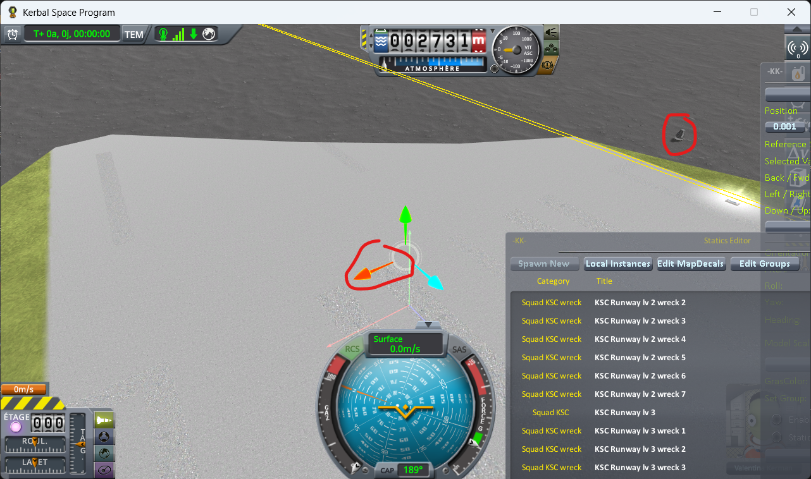

   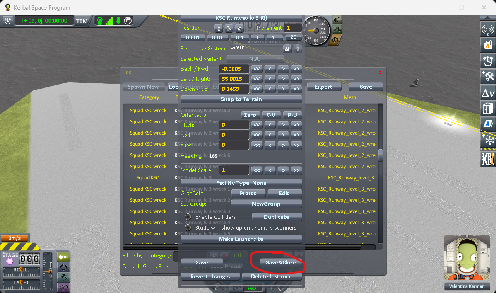

5. **Launch the same craft a second time**: go back to the Space Center from the pause menu, launch it
   from the Spaceplane Hangar again, SAS on, and move it to the Mun with the same latitude and
   longitude. It lands a few kilometres from the runway.

   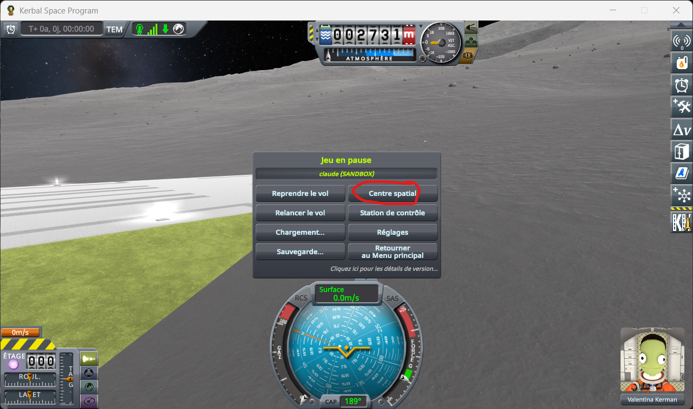

   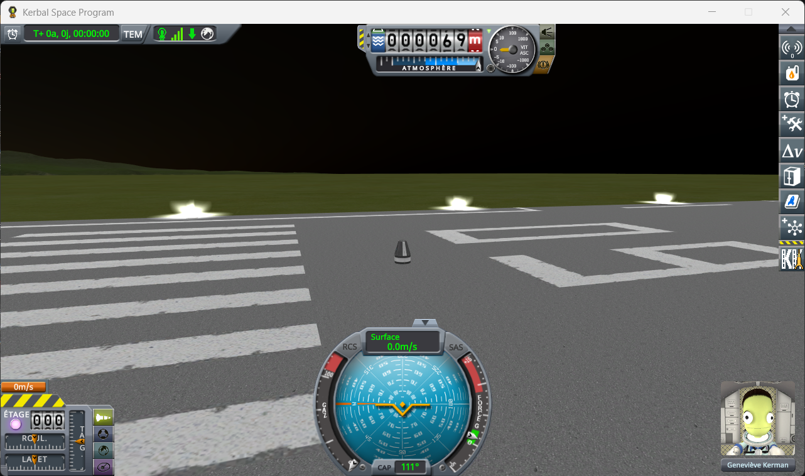

   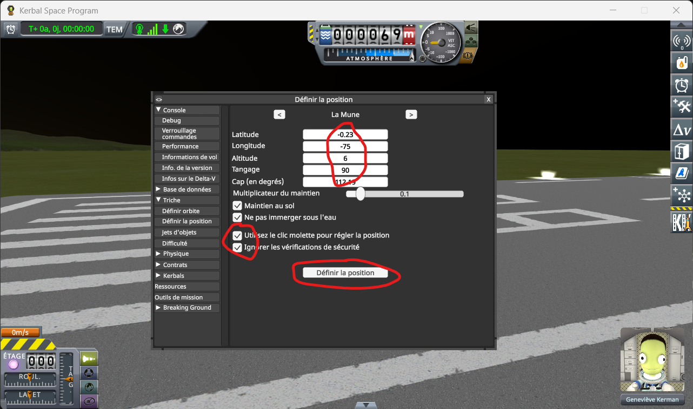

   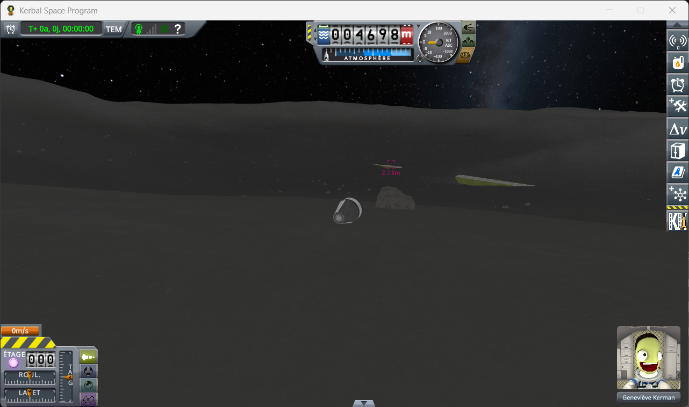

6. **Put it on the runway**: open *Set Position* again and middle-click the runway: latitude and
   longitude now read the spot you clicked. Press *Set Position*.

   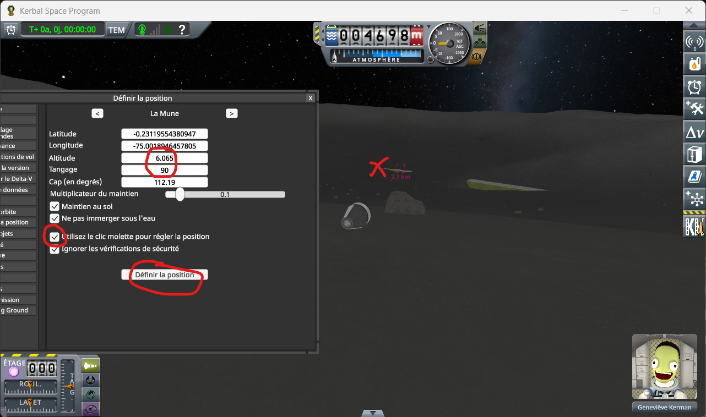

   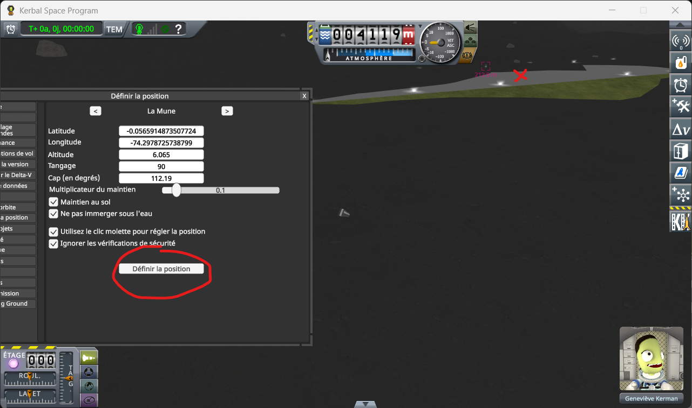

7. **Save once**, from the pause menu, with SAS off.

   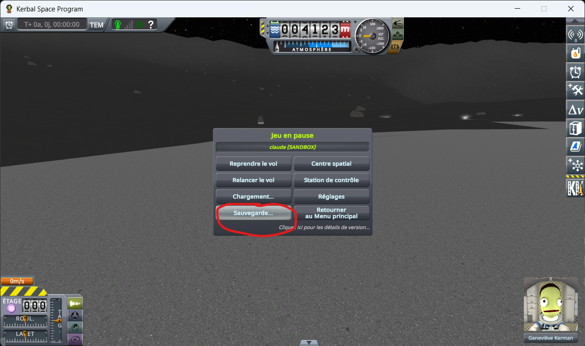

## The protocol

**1. Load the save.** You are flying the craft on the grass. Wait for the digits to stop moving, then
press *Record*.

**2. Switch to the craft on the runway** with `[`, one of the game's two default *switch vessel* keys.

Wait for the digits to stop moving, then press *Record*.

**3. Load the same save again**, and repeat steps 1 and 2 — six times in all, two lines each time,
always in the same order.

⚠️ **Never save over the save you load.** Every loading must start from that same save.

One loading says nothing on its own: it is the series that is worth reading, not a line.

On the Mun, do the same with [`runway-mun-kk.sfs`](../diag/runway-mun-kk.sfs), the craft on the ground
taking the place of the one on the grass.
